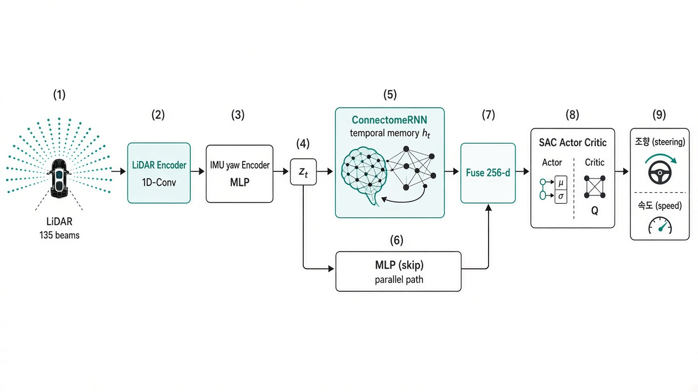
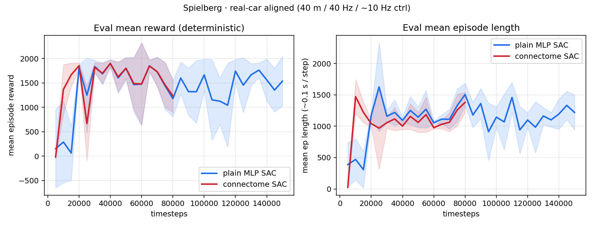
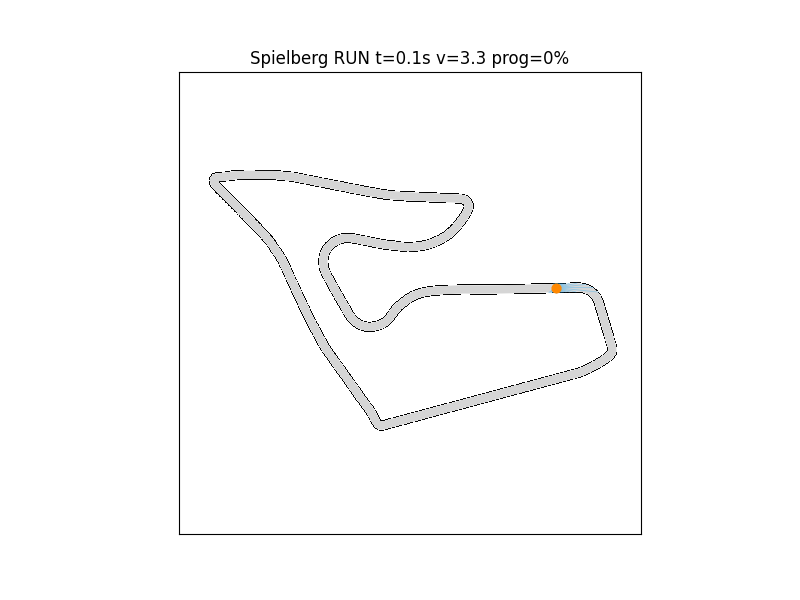
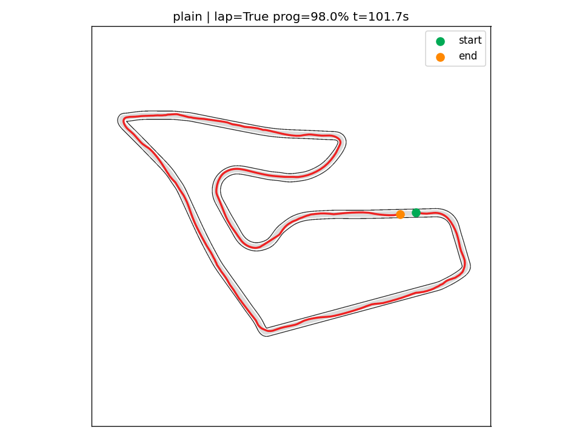
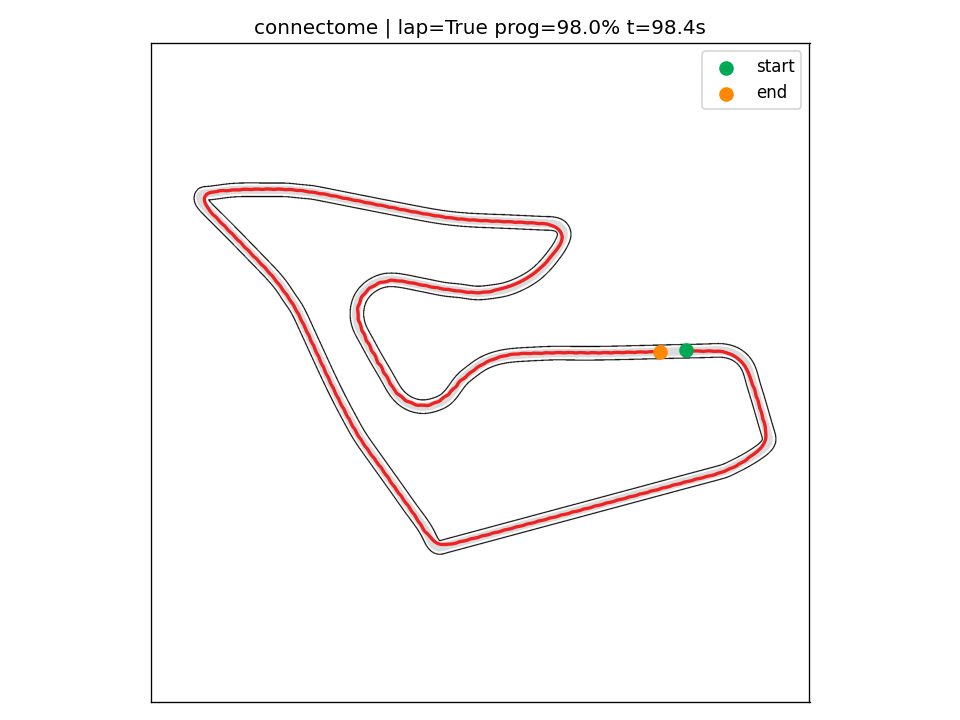
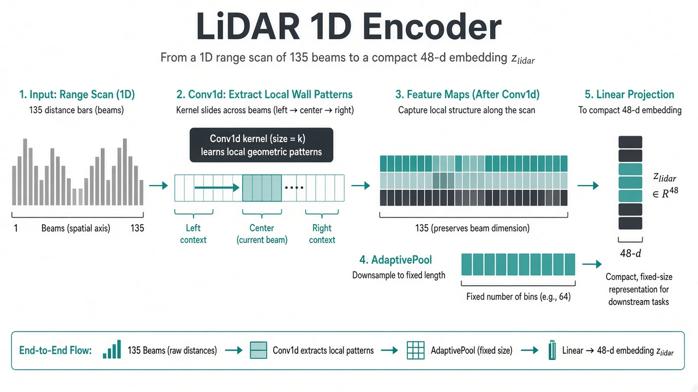
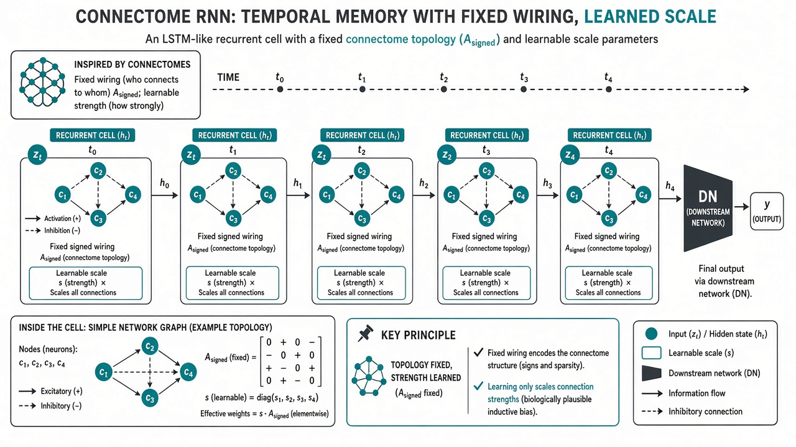

# robo_testr

초파리 **hemibrain 커넥톰**을 **시간축 temporal memory**로 학습하는  
**SAC** 기반 F1TENTH **mapless** 레이싱 레포.  
학습·추론은 **GPU(CUDA / Jetson)** 우선, CPU는 폴백.

| 구분 | 본선 | Ablation / 레거시 |
|------|------|-------------------|
| 알고리즘 | **SAC** + ConnectomeRNN (학습) | plain MLP SAC / PPO |
| Env | `f1tenth_mapless_env.py` | `lidar_race_env.py` (ajou PPO) |
| 관측 | LiDAR 135×5 + yaw×5 → **680** | dim 82 (레거시) |
| LiDAR 시뮬 | **40 m / 40 Hz** (실차), 제어 frame_skip=4 → **~10 Hz** | — |
| 보상 | privileged CL progress (관측은 mapless) | mapless LiDAR+odom |
| 디바이스 | `--device auto\|cuda` (Jetson GPU) | CPU 가능 |
| 체크포인트 | `EvalCallback`(deterministic) + `best_model` + periodic ckpt | — |

```bash
# GPU 있으면 자동 cuda (Jetson / PC)
python train_sac_connectome.py --use-cache --map Spielberg --timesteps 200000 --fresh \
  --device cuda --max-neurons 256 --batch-size 512

python watch_sac_f1tenth.py --model connectome_sac_f1tenth_Spielberg.zip --map Spielberg --use-cache
```

실차: `Roboracer-2026-main/` (Jetson ROS2).

---

## 파이프라인 한눈에 (그림)

<p align="center">
  
</p>

**흐름:** LiDAR·IMU → 인코더 → ConnectomeRNN(시간 메모리) ‖ skip → Fuse → SAC → 조향·속도  
배포: `/scan`(+yaw) → 같은 정책 → `/drive` (맵/센터라인 불필요)

---

## 1. 한 줄 요약

| 질문 | 답 |
|------|----|
| 무엇을 풀나? | mapless LiDAR로 F1TENTH 트랙 주행 |
| 왜 SAC? | 연속 행동 + off-policy (GPU 배치 학습과 잘 맞음) |
| 커넥톰? | LSTM 역할의 **고정 배선 RNN 메모리** (scale/\(W_{in}\) 학습) |
| 인코더? | 원시 센서를 짧은 벡터로 압축 (아래 개념 절) |
| Jetson? | `device=cuda`, dense matmul, 배치 인코딩으로 **GPU 비중↑** |

### 타이밍 (실차 정렬 · 학습 안정)

| | 값 | 이유 |
|--|-----|------|
| LiDAR 주기 | **40 Hz** (`DT=0.025`) | 실차 측정 주기 |
| 거리 상한 | **40 m** | 실차 range |
| 레이 샘플 | 맵 `resolution`(~5 cm) | 얇은 벽 관통 방지 |
| `frame_skip` | **4** → 제어 **~10 Hz** | 50→10 Hz로 행동 차이·히스토리 정보량 확보 |
| 히스토리 5프레임 | span ≈ **0.4 s** | skip 간격으로 스택 (예전 0.08 s) |
| 스폰 | CL **전체** + 헤딩/횡 노이즈 | 직선만 버퍼에 쌓이는 것 방지 |
| 랩 | `truncate` + 보너스 30 (terminate 아님) | Q 절벽 완화 |
| 보상 v4 | alive +0.2 / crash −10 / progress×4 | 짧은 충돌이 “best”로 잡히던 붕괴 방지 |
| 학습 저장 | `runs/*/best`(길이 우선), `checkpoints` | EvalCallback length-aware |

A/B: **먼저** `train_sac_plain.py` (Eval deterministic). plain도 무너지면 env/SAC, plain만 안정이면 커넥톰.

---

## 학습 결과 (Spielberg · 실차 정렬 A/B)

실차 스펙 env (`40 m` LiDAR / `40 Hz` sim / 제어 `~10 Hz`)에서  
**plain MLP SAC 150k** 완료 + **connectome SAC ~80k** 저장 후 deterministic watch.

| 모델 | steps | 대표 seed0 랩 | 비고 |
|------|------:|---------------|------|
| plain MLP SAC | 150k | **101.7 s** 완주 | `plain_sac_f1tenth_Spielberg.zip` |
| connectome SAC | ~80k | **98.4 s** 완주 | `connectome_sac_f1tenth_Spielberg_80k.zip` (best도 랩 가능) |

<p align="center">
  
</p>

Deterministic eval: 두 모델 모두 ~10k 이후 **랩 완주 구간**(ep_len ≈ 1000–1500 ≈ 100–150 s)에 진입.  
connectome은 초반 상승이 더 가파름(10k에서 이미 랩). plain은 150k까지 안정적으로 유지.

| | plain last (seed0) | connectome 80k (seed0) |
|--|--------------------|------------------------|
| GIF |  |  |
| traj |  |  |

```powershell
# 결과 재현 (GIF + traj PNG)
python watch_sac_f1tenth.py --model plain_sac_f1tenth_Spielberg.zip --map Spielberg --plain --seed 0
python watch_sac_f1tenth.py --model connectome_sac_f1tenth_Spielberg_80k.zip --map Spielberg --use-cache --seed 0
python plot_sac_results.py   # → docs/figures/sac_ab_eval_curves.png
```

체크포인트: `runs/plain_Spielberg/`, `runs/connectome_Spielberg/` (gitignore). zip은 로컬 보관.

### 왜 7 m/s까지 안 올라가냐?

속도는 정책이 “마음대로” 올리는 게 아니라 **환경 상한**에 클립됩니다.

```text
v_cmd = min_speed + action_speed * (max_speed - min_speed)
```

지금까지 학습은 **안정 커리큘럼**으로 `--max-speed 3.5`를 썼습니다.  
그래서 액션이 1.0이어도 **물리적으로 3.5 m/s가 천장**입니다. env 상수 `MAX_SPEED=7.0`은 있어도, train 인자가 막으면 7까지 안 갑니다.

| 단계 | 목적 | 예시 |
|------|------|------|
| 1 (완료) | 생존·랩 | `--max-speed 3.5` |
| 2 | 레이싱 가속 | 3.5 ckpt `--resume` → `--max-speed 5.0` |
| 3 | F1TENTH 상한 | → `--max-speed 7.0` + 코너 감속 보상 강화 |

```powershell
# 다음 레이싱 단계 예 (3.5 랩 가능 모델에서 이어 학습)
python train_sac_plain.py --map Spielberg --timesteps 100000 `
  --min-speed 2 --max-speed 5.0 --max-steer 0.30
# 그다음 7.0
```

진짜 “F1처럼”은 단순 max만 올리면 벽에 박습니다. **직선 가속 + 코너 감속**이 보상/관측에 드러나야 합니다 (다음 작업).

### 제로샷 전이 · 실차 맵 `ajou`

`--map ajou` → `Roboracer-2026-main/maps/cartographer_map_20260817_003202`.  
Spielberg 학습 zip을 **재학습 없이** ajou에 올리면 (seed 0–5) plain/connectome 모두 **랩 완주·무충돌** (랩 ~15–23 s, 코스가 짧음).

```powershell
python watch_sac_f1tenth.py --model plain_sac_f1tenth_Spielberg.zip --map ajou --plain --seed 0
python watch_sac_f1tenth.py --model connectome_sac_f1tenth_Spielberg_80k.zip --map ajou --use-cache --seed 0
```

---

## 2. 모듈 개념 설명 (초심자용)

### 2.1 왜 “인코더”가 필요한가?

LiDAR 한 프레임은 **135개 거리값**. 매 스텝 이걸 그대로 거대한 MLP에 넣으면:

- 파라미터·노이즈가 많고  
- “왼쪽 벽 / 전방 갭” 같은 **국소 패턴**을 매번 처음부터 배워야 함  

**인코더** = 센서 → **의미 있는 짧은 특징 벡터** \(z\).  
CNN/MLP가 “가까운 빔끼리의 패턴”을 먼저 뽑아주면, 뒤의 커넥톰·SAC가 주행만 배우기 쉬워진다.

### 2.2 LiDAR Encoder (1D Conv)

<p align="center">
  
</p>

| 개념 | 설명 |
|------|------|
| 입력 | 빔 배열 \(d\in\mathbb{R}^{135}\) (거리/10으로 정규화) |
| **축의 의미** | 이미지가 아니라 **각도 방향의 1D 신호**. 옆 빔 = 비슷한 시야 |
| Conv1d | 작은 커널이 빔을 따라 미끄러지며 **국소 벽·갭 패턴** 추출 |
| Pool + Linear | 길이를 줄여 \(z_{\mathrm{lidar}}\in\mathbb{R}^{48}\) |
| 구현 | `policy_sac_connectome.py` → `LidarEncoder` |
| GPU | **5프레임을 한 번에** `(B·T, 1, 135)` 배치 Conv → GPU 점유↑ |

직관: “사진용 2D CNN”의 1D 버전. 전방 중앙이 막히면 중앙 채널 활성, 한쪽 벽이면 좌/우 패턴.

### 2.3 IMU Encoder (MLP)

| 개념 | 설명 |
|------|------|
| 입력 | yaw rate \(\tilde\omega=\mathrm{clip}(\dot\theta/3,-1,1)\) (히스토리 5칸) |
| 역할 | “지금 얼마나 회전 중인지”를 짧은 벡터로 |
| 출력 | \(z_{\mathrm{imu}}\in\mathbb{R}^{16}\) |
| 합치기 | \(z_t = [z_{\mathrm{lidar}}; z_{\mathrm{imu}}]\in\mathbb{R}^{64}\) |

LiDAR만으로도 회전은 추정 가능하지만, yaw를 직접 주면 **고속 코너**에서 신호가 더 또렷하다.

### 2.4 ConnectomeRNN = 시간 메모리 (LSTM 자리)

<p align="center">
  
</p>

| 개념 | 설명 |
|------|------|
| 왜 메모리? | 한 프레임만 보면 POMDP (속도·곡률 변화 모호) |
| 히스토리 스택 | obs에 이미 5프레임 포함 |
| **RNN unroll** | \(t=0..4\) 순서로 \(h\)를 넘기며 갱신 (LSTM 셀 대신 **초파리 배선**) |
| 고정 | \(A_{\mathrm{signed}\) — 누가 누구와 연결되는지 |
| 학습 | \(\mathrm{scale}\) (세기), \(W_{\mathrm{in}}\) (입력 주입) |
| 출력 | DN 활성 \(y_4\) → “행동 관련 요약” |

수식 (leaky rate RNN):

\[
W_{\mathrm{eff}}=A_{\mathrm{signed}}\odot\mathrm{scale}\odot M_{\mathrm{topo}}
\]

\[
h \leftarrow h + \frac{\Delta t}{\tau}\Big(-h + \tanh(W_{\mathrm{eff}}^\top h + \mathrm{drive}(z))\Big)
\]

**LSTM과 비교**

| | LSTM | ConnectomeRNN (본 레포) |
|--|------|-------------------------|
| 구조 | 학습된 게이트 | **생물 배선 prior** |
| 새 연결 | 자유롭게 생김 | **금지** (토폴로지 고정) |
| 역할 | 시계열 압축 | 동일 + 해석 가능한 prior |

### 2.5 skip MLP · Fuse · SAC

| 모듈 | 하는 일 |
|------|---------|
| **skip** | \(z\) 평균을 MLP로 바로 보냄 — 커넥톰이 흔들려도 주행 학습 경로 유지 |
| **fuse** | `[skip; DN]` → 256차원 공통 feature |
| **SAC Actor** | feature → 조향·속도 분포 |
| **SAC Critic** | feature+action → soft Q |

SAC 목표 (최대 엔트로피):

\[
J(\pi)=\mathbb{E}\Big[\sum_t \gamma^t\big(r_t+\alpha\mathcal{H}(\pi(\cdot|s_t))\big)\Big]
\]

---

## 3. GPU / Jetson 설계

나중에 **Jetson에 올려 GPU를 쓰게** 맞춘 포인트:

| 항목 | CPU | GPU (CUDA / Jetson) |
|------|-----|---------------------|
| Connectome matmul | **sparse** (희소 연결) | **dense** \(h W^\top\) — Tensor 코어에 유리 |
| LiDAR 인코딩 | 프레임 루프도 가능 | **B×T 배치 Conv1d** 한 방 |
| SAC batch | 256 | 기본 **512** (`--batch-size`) |
| cuDNN | — | `cudnn.benchmark=True` |
| 디바이스 | `--device cpu` | `--device cuda` 또는 `auto` |

```bash
# Jetson / CUDA PC
python train_sac_connectome.py --use-cache --map Spielberg --device cuda \
  --max-neurons 256 --batch-size 512 --n-envs 4 --timesteps 300000 --fresh

# 추론도 동일 zip, device=cuda
```

**주의:** 시뮬 env(레이캐스트)는 아직 CPU. **정책 forward/backward만 GPU**.  
Jetson에서는 env step이 짧고 배치 추론이 잦을수록 GPU 비율이 커진다.  
추후: TensorRT / `torch.jit` / ONNX로 추론만 더 가속 가능.

---

## 4. 이론 요약 (MDP · 보상)

### MDP

| 기호 | 내용 |
|------|------|
| \(s\) | LiDAR hist + yaw hist (맵 없음) |
| \(a\) | \([a^{\mathrm{steer}}, a^{\mathrm{speed}}]\) |
| \(r\) | 시뮬: CL progress (privileged) |
| \(\gamma\) | 0.99 |

### 관측 레이아웃 (680)

```text
[ LiDAR t-4 … t ][ yaw × 5 ]
     675              5
```

### 보상 (privileged · v4)

\[
\begin{aligned}
r &= 4\max(\Delta s,0) + 0.2 + 0.15\max(\cos\phi,0)
    + 0.25\,v_{\mathrm{norm}}\max(\cos\phi,0)\\
    &\quad - 0.1\max(\mathrm{CTE}-0.7,0) - 0.4\max(-\Delta s,0)\\
r &\leftarrow \mathrm{clip}(r,-2,10)
\end{aligned}
\]

충돌 \(-10\), 랩 \(+30\) (truncate). alive 항으로 **긴 주행 > 짧은 충돌**.  
**실차 추론에는 센터라인 불필요** (관측 mapless).

### 제어 · 동역학

\[
\delta=a_0\delta_{\max},\quad
v^{\mathrm{cmd}}=v_{\min}+a_1(v_{\max}-v_{\min})
\]

기본 커리큘럼 \(v\in[2,3.5]\), \(\delta_{\max}=0.30\), 물리 \(\Delta t=0.025\) (40 Hz),  
제어 `frame_skip=4` → \(\Delta t_{\mathrm{ctrl}}=0.1\) (~10 Hz), \(L=0.33\).

---

## 5. 정책 의사코드

```text
# GPU: LidarEnc/IMUEnc on all frames batched
Z = EncodeAllFrames(lidar[B,T,135], yaw[B,T])   # → z[B,T,64]

h = 0
for t in 0..4:
    y, h = ConnectomeRNN(z[:,t], h)             # CUDA: dense W

feat = Fuse( Skip(mean_t z) , y_DN )
a ~ Actor(feat)                                 # SAC
```

| 모듈 | 학습 |
|------|------|
| LidarEnc, IMUEnc | ✅ |
| \(A_{\mathrm{signed}}\) | ❌ 고정 |
| scale, \(W_{\mathrm{in}}\) | ✅ |
| skip, fuse, π, Q | ✅ |

`--freeze-connectome`: 커넥톰 미학습 ablation.

---

## 6. 학습 커맨드 · 하이퍼

| 항목 | 기본 |
|------|------|
| `max_neurons` | 256 |
| `device` | `auto` → cuda 우선 |
| `batch_size` | CUDA 512 / CPU 256 |
| `train_freq` / `grad_steps` | 4 / 4 |
| `learning_starts` | 3000 |
| `target_entropy` | **-2.0** (행동 dim=2) |

```powershell
python train_sac_connectome.py --use-cache --map Spielberg --timesteps 150000 --fresh `
  --device auto --max-neurons 256 --min-speed 2 --max-speed 3.5 --max-steer 0.30

python train_sac_plain.py --map Spielberg --timesteps 150000 --fresh `
  --min-speed 2 --max-speed 3.5 --max-steer 0.30
```

| 로그 | 의미 |
|------|------|
| `ep_len_mean` | 생존 (×0.1≈초 @10 Hz) **1순위** |
| `eval/mean_ep_length` | deterministic 길이 (best 저장 기준) |
| `ep_rew_mean` | 보상 합 (식 바꾸면 비교 금지) |
| `fps` | CPU env 병목 시 낮을 수 있음 |
| `[lap]` | 완주 |

---

## 7. 파일 지도

| 경로 | 역할 |
|------|------|
| `docs/figures/*.png` | 구조·인코더·메모리 **개념 그림** |
| `f1tenth_mapless_env.py` | Gym env |
| `policy_sac_connectome.py` | 인코더 + temporal connectome + fuse |
| `connectome_rnn.py` | leaky RNN (**CUDA dense / CPU sparse**) |
| `connectome_loader.py` | hemibrain 서브서킷 |
| `train_sac_connectome.py` | SAC (`--device`) |
| `train_sac_plain.py` | MLP ablation |
| `watch_sac_f1tenth.py` | GIF + traj PNG |
| `plot_sac_results.py` | plain/connectome eval 곡선 |
| `train_callbacks.py` | length-aware Eval + ckpt |
| `roboracer_connectome_node.py` | Jetson `/drive` 스케치 |

---

## 8. 설치 · Jetson 메모

```powershell
pip install -r requirements.txt
# CUDA wheel: 환경에 맞는 torch 설치 (Jetson은 NVIDIA 문서의 PyTorch wheel)
python -c "import torch; print(torch.cuda.is_available(), torch.cuda.get_device_name(0))"
```

hemibrain: `download_hemibrain.py` 후 `--use-cache`. 토큰 깃 금지.

실차:

```text
Roboracer: /scan → Stanley → /drive
본 레포:   /scan(+yaw) → 정책(cuda) → /drive
```

---

## 9. 권장 순서

1. Env 스모크 `python f1tenth_mapless_env.py`  
2. plain SAC로 `ep_len` 상승 확인  
3. connectome SAC `--device cuda` (가능하면)  
4. watch GIF  
5. 속도 커리큘럼 3.5→7  
6. Jetson zip + ROS2 저속  

---

## 10. 한계 · FAQ

- 5프레임 메모리 ≠ 에피소드 전체 LSTM 상태  
- env 물리/레이캐스트는 CPU — 정책만 GPU  
- `fly-brain`(전뇌 LIF)은 참고용; 본선 RL 루프와는 별개  
- zip / cache / watch_out gitignore  

**Q. 인코더 없이 안 되나요?**  
A. 가능하지만(plain MLP) 빔 패턴을 정책이 통째로 배워야 해서 샘플이 더 필요합니다.

**Q. Jetson에서 CPU만 쓰이면?**  
A. `torch.cuda.is_available()` 확인, `--device cuda`, Jetson용 PyTorch 휠 설치.

**Q. 커넥톰이 LSTM인가요?**  
A. 역할은 같고, 구조는 **고정 초파리 배선 + 학습 scale**입니다.

---

## 참고

- https://github.com/tkddn647-ship-it/2027_F1tenth_test  
- [neuPrint hemibrain](https://neuprint.janelia.org)  
- [f1tenth_racetracks](https://github.com/f1tenth/f1tenth_racetracks)  
- Soft Actor-Critic (Haarnoja et al.)  
- FLYNN-style connectome-constrained RNN  
