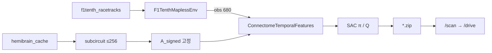
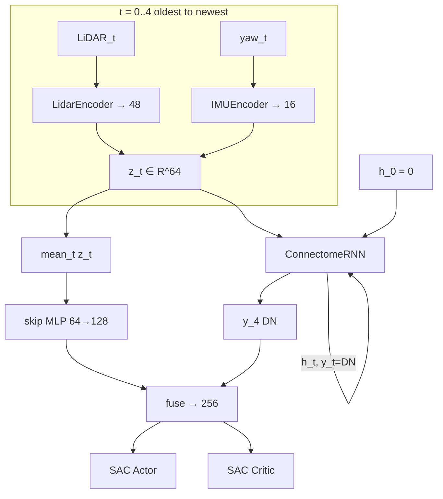
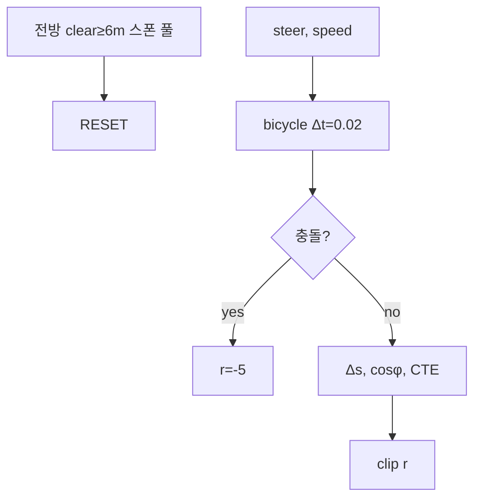

# robo_testr

초파리 **hemibrain 커넥톰**을 **시간축 temporal memory**로 학습하는  
**SAC** 기반 F1TENTH **mapless** 레이싱 레포.

| 구분 | 본선 | Ablation / 레거시 |
|------|------|-------------------|
| 알고리즘 | **SAC** + ConnectomeRNN (학습) | plain MLP SAC / PPO |
| Env | `f1tenth_mapless_env.py` | `lidar_race_env.py` (ajou PPO) |
| 관측 | LiDAR 135×5 + yaw×5 → **680** | dim 82 (레거시) |
| 보상 | privileged CL progress (관측은 mapless) | mapless LiDAR+odom (레거시) |
| 커넥톰 | **5프레임 unroll**, \(A\) 고정, scale/\(W_{in}\) **학습** | freeze 옵션 / 없음 |

```bash
# 본선: 커넥톰 temporal memory 학습
python train_sac_connectome.py --use-cache --map Spielberg --timesteps 200000 --fresh \
  --max-neurons 256 --min-speed 2 --max-speed 3.5 --max-steer 0.30

# MLP ablation (커넥톰 없이 동일 env)
python train_sac_plain.py --map Spielberg --timesteps 120000 --fresh

# 시각화
python watch_sac_f1tenth.py --model connectome_sac_f1tenth_Spielberg.zip --map Spielberg --use-cache
```

실차: `Roboracer-2026-main/` (Jetson ROS2).

---

## 1. 한 줄 요약

| 질문 | 답 |
|------|----|
| 무엇을 풀나? | mapless LiDAR로 F1TENTH 트랙 주행 (조향+속도) |
| 왜 SAC? | 연속 행동, off-policy 샘플 효율 |
| 커넥톰 역할? | LSTM 대신 **생물 배선 prior를 가진 RNN 메모리** (시간축 학습) |
| mapless? | **관측**에 맵/CL 없음. 시뮬 **보상만** CL progress (privileged) |
| 실차? | `/scan`(+yaw) → 정책 → `/drive` (CL 불필요) |

---

## 2. 이론 배경

### 2.1 MDP

상태 \(s_t\), 행동 \(a_t\), 보상 \(r_t\), 전이 \(P\), 할인 \(\gamma\):

\[
\max_\pi \; \mathbb{E}_\pi\Big[\sum_{t=0}^{T} \gamma^t r_t\Big]
\]

본 레포:

| 기호 | 내용 |
|------|------|
| \(s_t\) | LiDAR 히스토리 + yaw 히스토리 (맵 좌표 없음) |
| \(a_t\) | \([a^{\mathrm{steer}}, a^{\mathrm{speed}}]\in[-1,1]\times[0,1]\) |
| \(r_t\) | 시뮬: CL 진행·정렬·생존 (아래 식) |
| \(\gamma\) | 0.99 |

### 2.2 Soft Actor-Critic (SAC)

SAC는 **최대 엔트로피 RL**:

\[
J(\pi) = \mathbb{E}\Big[\sum_t \gamma^t \big(r_t + \alpha\,\mathcal{H}(\pi(\cdot|s_t))\big)\Big]
\]

- Critic \(Q_\psi\): soft Bellman  
  \(Q(s,a) \approx r + \gamma\big(Q_{\bar\psi}(s',a') - \alpha\log\pi(a'|s')\big)\)
- Actor \(\pi_\phi\): \(Q\)를 크게, 엔트로피도 유지  
- \(\alpha\): `ent_coef="auto"`로 학습, `target_entropy=-1.0` (조향 폭주 완화)

**왜 PPO가 아니라 SAC?**  
연속 조향·속도에서 replay로 샘플을 재사용해 CPU에서도 비교적 효율적.  
(레거시 ajou 실험은 PPO.)

### 2.3 부분관측과 “메모리”

한 프레임 LiDAR만으로는 속도·곡률 변화 추론이 어렵다 → **POMDP**.  
대응:

1. **명시적 히스토리**: 관측에 최근 5프레임을 스택  
2. **학습 메모리**: ConnectomeRNN이 프레임 순서로 \(h\)를 갱신 (LSTM 역할)

에피소드 전체 hidden을 SB3가 들고 가지는 않음.  
**관측 윈도우(5프레임) 안에서의 recurrent unroll**이 현재 구현.

### 2.4 초파리 커넥톰 prior (FLYNN 스타일)

Hemibrain에서 가져온 인접행렬 \(A_{\mathrm{signed}}\):

- 원소 \(A_{ij}\neq 0\): 시냅스 존재 + 흥분/억제 부호  
- **토폴로지는 학습으로 바뀌지 않음** (새 엣지 금지)

학습 파라미터:

\[
W_{\mathrm{eff}} = A_{\mathrm{signed}} \odot \mathrm{scale} \odot M_{\mathrm{topo}}
\]

- \(\mathrm{scale}\): 연결 **세기** (학습)  
- \(W_{\mathrm{in}}\): 인코더 특징 → 입력 뉴런 (학습)  
- 출력: descending(DN) 등 `output_idx` 활성

Leaky RNN (연속시간 근사):

\[
h \leftarrow h + \frac{\Delta t}{\tau}\Big(-h + \tanh(W_{\mathrm{eff}}^\top h + \mathrm{drive}(x))\Big)
\]

생물 해석(요약):

| 영역 | 역할 (단순화) |
|------|----------------|
| 운동/시각 입력 뉴런 | LiDAR·모션 유사 입력 |
| CX 등 | 통합·상태 |
| DN | 하행 → “행동 관련 feature” |

우리는 전체 뇌를 쓰지 않고 **속도·운동 관련 서브서킷** (`max_neurons`, 기본 256)을 잘라 쓴다.

### 2.5 Mapless vs Privileged reward

| | 관측 | 보상 |
|--|------|------|
| 이상적 mapless | 센서만 | 센서/odom만 |
| **본선 시뮬** | 센서만 | CL progress (privileged) |
| 실차 추론 | 센서만 | — |

시뮬에서 privileged 보상을 쓰는 이유: 고속 레이스에서 “앞으로 가라”는 신호를 촘촘히 주기 위함.  
**배포 시 정책 입력에는 CL이 필요 없음.**

---

## 3. 구조 시각화

### 3.1 시스템



### 3.2 관측 (dim 680)

```text
[ LiDAR t-4 | t-3 | t-2 | t-1 | t ][ yaw×5 ]
  135×5 = 675                          5
```

- FOV 270°, range 10 m, \(d\leftarrow\mathrm{clip}(r/10,0,1)\)
- yaw: \(\tilde\omega=\mathrm{clip}(\dot\theta/3,-1,1)\)

### 3.3 정책: 시간축 커넥톰 메모리 (본선)



**의사코드**

```text
h = 0
for t in 0..4:
    z_t = [LidarEnc(lidar_t); IMUEnc(yaw_t)]
    y_t, h = ConnectomeRNN(z_t, h, n_inner_steps=1)   # scale, W_in 학습
feat = fuse( skip(mean z) ‖ y_4 )
a ~ π(·|feat)
```

| 모듈 | 학습 | 역할 |
|------|------|------|
| LidarEnc / IMUEnc | ✅ | 센서 → \(z_t\) |
| \(A_{\mathrm{signed}}\) | ❌ | 배선 prior |
| scale, \(W_{\mathrm{in}}\) | ✅ | 세기·입력 인터페이스 |
| skip + fuse | ✅ | 안정용 우회 + 융합 |
| SAC π/Q | ✅ | 조향·속도 / 가치 |

`--freeze-connectome` 이면 scale/\(W_{in}\) 고정 (ablation).

### 3.4 Env · 스폰 · 보상



**제어**

\[
\delta = a_0\delta_{\max},\quad
v^{\mathrm{cmd}}=v_{\min}+a_1(v_{\max}-v_{\min})
\]

기본 커리큘럼: \(v\in[2,3.5]\), \(\delta_{\max}=0.30\).

**동역학** (\(L=0.33\))

\[
\begin{aligned}
v &\leftarrow \mathrm{clip}(v+0.5(v^{\mathrm{cmd}}-v),\,v_{\min},v_{\max})\\
x &\leftarrow x+v\cos\theta\,\Delta t,\quad
y \leftarrow y+v\sin\theta\,\Delta t\\
\theta &\leftarrow \theta+\frac{v}{L}\tan\delta\,\Delta t
\end{aligned}
\]

**보상 (privileged)**

\[
\begin{aligned}
r &= 0.25 + 8\max(\Delta s,0) + \max(\cos\phi,0)
    + 0.5\,v_{\mathrm{norm}}\max(\cos\phi,0)
    - 0.4\max(\mathrm{CTE}-0.4,0)\\
r &\leftarrow \mathrm{clip}(r,-2,10)
\end{aligned}
\]

충돌 \(r=-5\), 랩 완주 \(r=100\).

\(\Delta s\): centerline 호장 진행(m). nearest index는 **전방 편향** 윈도우로 flicker 억제.

---

## 4. 학습 설정

| 항목 | 기본 |
|------|------|
| `max_neurons` | **256** (CPU 친화) |
| `learn_connectome` | True (기본) |
| `n_envs` | 2 |
| `learning_rate` | 3e-4 |
| `learning_starts` | 3000 |
| `train_freq` / `gradient_steps` | 4 / 4 |
| `buffer` / `batch` | 200k / 256 |
| `target_entropy` | -1.0 |
| device | `auto` (CUDA 있으면 GPU) |

```powershell
python train_sac_connectome.py --use-cache --map Spielberg --timesteps 200000 --fresh `
  --max-neurons 256 --n-envs 2 --min-speed 2 --max-speed 3.5 --max-steer 0.30
```

### 로그 해석

| 지표 | 의미 |
|------|------|
| `ep_len_mean` | 생존 step (×0.02≈초). **1순위** |
| `ep_rew_mean` | 보상 합 (식 바꾸면 절대비교 금지) |
| `fps` | 커넥톰 unroll 시 CPU에서 낮음 (정상 범위 있음) |
| `[lap]` | 완주 |

**과거 실패에서 배운 것**

1. 스폰이 나쁘면 직진도 즉시 충돌 → 전방 여유 스폰 풀  
2. CTE 과패널티 → 긴 에피소드가 손해가 되어 조기 충돌 선호  
3. N=800 + freeze-only → 느리고 “기억 학습”이 아님  
4. plain MLP는 동일 env에서 `ep_len` 상승 → env는 학습 가능  

---

## 5. 파일 지도

| 경로 | 역할 |
|------|------|
| `f1tenth_mapless_env.py` | Gym env, obs 680, spawn, privileged reward |
| `policy_sac_connectome.py` | 인코더 + **5프레임 ConnectomeRNN** + skip/fuse |
| `connectome_rnn.py` | leaky RNN, sparse \(W_{\mathrm{eff}}\) |
| `connectome_loader.py` | hemibrain 로드·서브서킷·\(A_{\mathrm{signed}}\) |
| `train_sac_connectome.py` | SAC 학습 |
| `train_sac_plain.py` | MLP ablation |
| `watch_sac_f1tenth.py` | GIF 시각화 |
| `download_hemibrain.py` | neuPrint 캐시 |
| `roboracer_connectome_node.py` | 실차 스케치 |
| `lidar_race_env.py` / `train_connectome.py` | 레거시 PPO |

---

## 6. 설치 · 데이터

```powershell
pip install -r requirements.txt
$env:NEUPRINT_APPLICATION_CREDENTIALS = "토큰"
python download_hemibrain.py   # 최초 1회
```

토큰을 깃에 올리지 말 것. 이후 `--use-cache`.

맵: `Spielberg` 등 → `f1tenth_racetracks/<Name>/`.  
공식 `f110_gym`은 Py3.14 비호환 → occupancy 폴백 사용.

---

## 7. 실차 정렬

```text
Roboracer-2026:  /scan → FGM/Stanley(CSV) → /drive
본 레포 추론:    /scan(+yaw) → 정책 → /drive
```

학습 Windows OK. ROS2는 Ubuntu/Jetson.  
`Roboracer-2026-main/src/race_pkg/ARCHITECTURE.md`

---

## 8. 권장 실험 순서

1. `python f1tenth_mapless_env.py` 스모크  
2. `train_sac_plain.py` 로 `ep_len` 상승 확인  
3. `train_sac_connectome.py --use-cache --max-neurons 256`  
4. `watch_sac_f1tenth.py` 궤적 확인  
5. 속도 상한 3.5→5→7 커리큘럼  
6. (선택) `--max-neurons 400` / GPU  
7. Jetson 저속 배포  

---

## 9. 레거시 PPO (ajou)

```powershell
python train_connectome.py --use-cache --env lidar --map ajou --timesteps 200000
```

obs 82, 보상 mapless LiDAR+odom, PPO. 본선과 관측/차원이 다름.

---

## 10. 한계

- 5프레임 unroll ≠ 에피소드 길이 LSTM 상태  
- CPU + 커넥톰은 fps 낮음 → `max_neurons`·`train_freq`로 조절  
- Spielberg 안정 완주는 추가 step 필요  
- `*.zip`, `hemibrain_cache/`, `watch_out_race/` gitignore  
- dim이 바뀐 zip은 resume 불가  

---

## 11. FAQ

**Q. 커넥톰이 LSTM인가요?**  
A. 역할은 유사(시간 메모리). 구현은 **고정 배선 + 학습 scale**인 leaky RNN이고, 윈도우 5프레임을 순서대로 unroll합니다.

**Q. 뉴런을 많이 늘리면?**  
A. prior는 풍부해지나 CPU에서 급격히 느려짐. 학습이 돌고 `ep_len`이 오른 뒤 N을 키우는 것을 권장.

**Q. freeze는?**  
A. `--freeze-connectome`: 배선 특징만 쓰고 scale 미학습. 본선 기본은 **학습**.

**Q. `ep_rew`가 음수면 실패?**  
A. 길이·식에 따라 음수일 수 있음. **`ep_len` / 랩**을 본다.

---

## 참고

- https://github.com/tkddn647-ship-it/2027_F1tenth_test  
- [neuPrint hemibrain](https://neuprint.janelia.org)  
- [f1tenth_racetracks](https://github.com/f1tenth/f1tenth_racetracks)  
- Haarnoja et al., Soft Actor-Critic  
- FLYNN-style connectome-constrained RNN  
