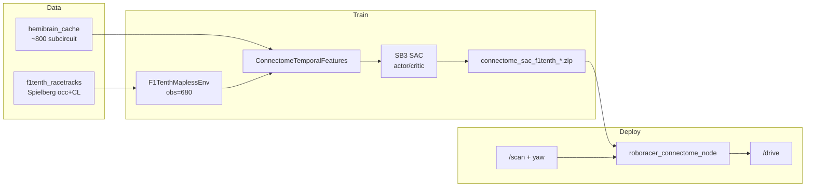
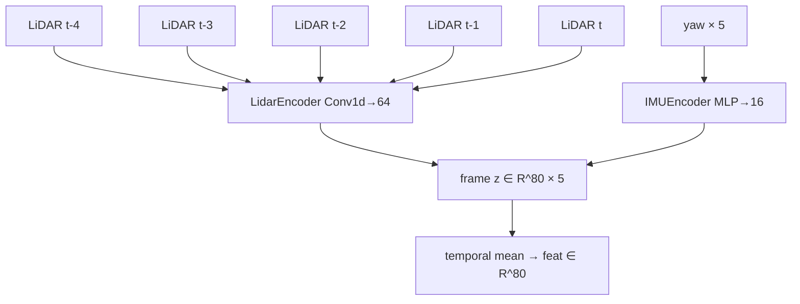
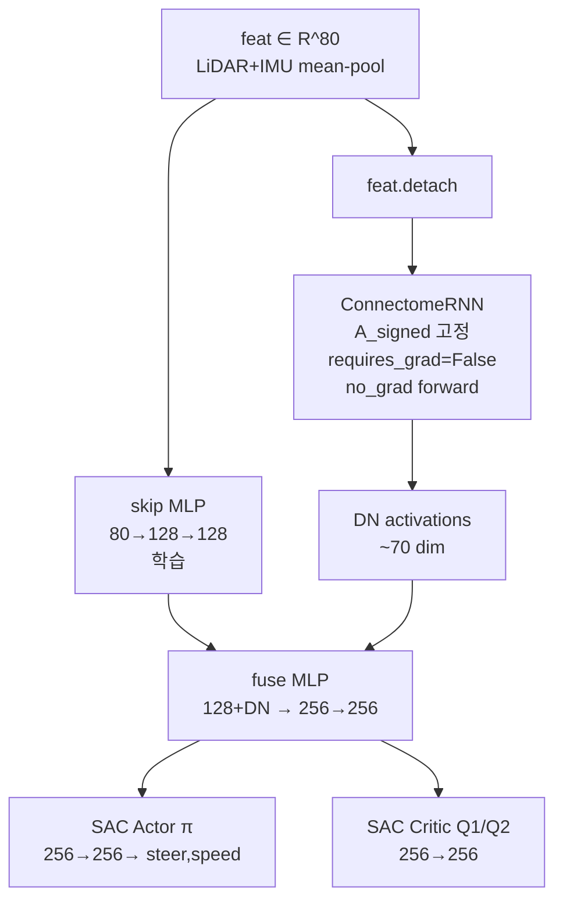
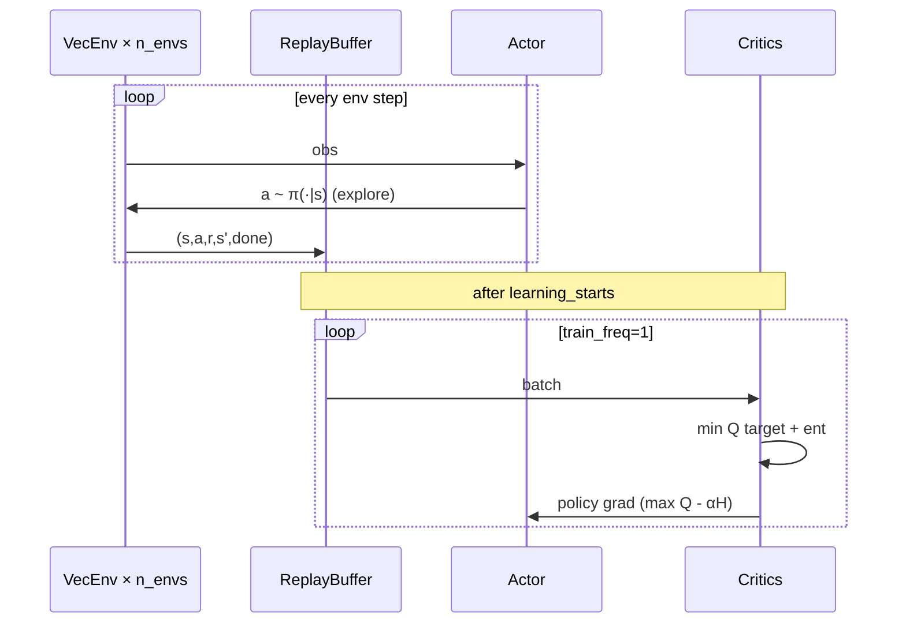

# robo_testr

초파리 **hemibrain 커넥톰**을 temporal prior로 쓰는  
**SAC** 기반 F1TENTH **mapless** 레이싱 레포입니다.

| 구분 | 본선 (현재) | 레거시 |
|------|-------------|--------|
| 알고리즘 | **SAC** | PPO |
| Env | `f1tenth_mapless_env.py` (Spielberg 등) | `lidar_race_env.py` (ajou) |
| 관측 | LiDAR 135×5 + yaw×5 → **dim 680** | LiDAR 20×4 + v + yaw → dim 82 |
| 보상 | privileged centerline progress (관측은 mapless) | mapless LiDAR+odom only |
| 학습 | `train_sac_connectome.py` | `train_connectome.py` |
| 시각화 | `watch_sac_f1tenth.py` | `watch_lidar_map.py` |

```bash
# 본선 학습
python train_sac_connectome.py --use-cache --map Spielberg --timesteps 300000 --fresh

# MLP ablation (커넥톰 없이 env/보상 검증)
python train_sac_plain.py --map Spielberg --timesteps 120000 --fresh

# 시각화 GIF
python watch_sac_f1tenth.py --model connectome_sac_f1tenth_Spielberg.zip --map Spielberg --use-cache
```

실차 스택: `Roboracer-2026-main/` (Ajou Jetson ROS2).

---

## 한 줄 요약

| 질문 | 답 |
|------|----|
| 알고리즘 | **SAC** (본선). PPO는 레거시 |
| mapless냐? | **관측 mapless** (LiDAR+yaw만). 보상은 시뮬 전용 privileged progress |
| 커넥톰 역할 | 고정 토폴로지 **prior** + DN 활성. 학습 경로는 skip MLP ‖ fuse |
| 속도 | 기본 커리큘럼 **2~4 m/s** (상한 7까지 CLI로 확장) |
| 조향 | 기본 **±0.30 rad** (학습 안정용; 물리 상한 ~0.42) |
| 공식 gym | Py3.14 비호환 → `f1tenth_racetracks` occupancy 폴백 |

---

## 전체 구조 시각화

### 1) 시스템 파이프라인



### 2) 관측 레이아웃 (dim = 680)

```text
┌────────────────────── obs ∈ R^680 ──────────────────────┐
│  LiDAR hist (5 frames × 135 beams)     │  yaw hist (5)  │
│  [d0_0 … d0_134 | … | d4_0 … d4_134]  │  [ω0…ω4]       │
│           675 dims                      │   5 dims       │
└─────────────────────────────────────────────────────────┘
  beams: FOV 270°, range 10 m, / RAY_RANGE → [0,1]
  yaw:   clip(yaw_rate / 3, -1, 1)
```



### 3) 정책 네트워크 (현재 fuse 구조)

학습이 막히지 않도록 **skip MLP가 주 경로**, 커넥톰은 **고정 prior**입니다.



| 모듈 | 학습? | 역할 |
|------|-------|------|
| `LidarEncoder` | ✅ | 135빔 → 64 |
| `IMUEncoder` | ✅ | yaw → 16 |
| `skip` MLP | ✅ | 주행에 필요한 주 feature |
| `ConnectomeRNN` | ❌ frozen + `no_grad` | hemibrain 토폴로지 prior → DN |
| `fuse` | ✅ | skip ‖ DN → 256 |
| SAC π / Q | ✅ | 연속 행동 / 가치 |

**왜 freeze?**  
커넥톰 scale까지 end-to-end로 풀면 CPU에서 느리고(≈10 fps), Q가 불안정해 `ep_rew`가 붕괴하는 경우가 많았음.  
plain MLP SAC는 동일 env에서 `ep_len` 72→470+로 학습됨 → **env는 학습 가능**, 커넥톰은 prior로 두는 쪽이 안정.

### 4) ConnectomeRNN (토폴로지 prior)

```mermaid
flowchart LR
  X[feat 80] --> WIN[W_in]
  WIN --> DRIVE[drive on input neurons]
  H[h ∈ R^N] --> WEFF["W_eff = A_signed ⊙ scale"]
  WEFF --> REC[recurrent]
  DRIVE --> PRE[tanh pre-act]
  REC --> PRE
  PRE --> H2[leaky update h]
  H2 --> OUT[h[output_idx] = DN]
```

\[
h \leftarrow h + \frac{\Delta t}{\tau}\Big(-h + \tanh(W_{eff}^\top h + drive(x))\Big)
\]

- \(A_{signed}\): 연결 유무·부호 **고정** (새 엣지 학습 불가)
- 현재 학습 설정에서는 `scale`/`W_in`도 **freeze** (prior only)
- 서브서킷 ≈ 800 뉴런, in≈726, out(DN)≈70, density ≈ 0.12%

### 5) Env · 스폰 · 보상

```mermaid
flowchart TB
  subgraph Spawn
    CL[centerline sample] --> CLR[forward clear ≥ 6 m]
    CLR --> SIDE[lane width ≥ 1.6 m]
    SIDE --> LC[lane-center offset]
    LC --> POOL[start pool ≤ 80 poses]
    POOL --> RESET[reset마다 random pick]
  end

  subgraph Step
    A["a = [steer_n, speed_n]"] --> CTRL[δ, v_cmd]
    CTRL --> BIKE[bicycle DT=0.02]
    BIKE --> OCC{occupied?}
    OCC -->|yes| CRASH[r=-5 terminate]
    OCC -->|no| PROG[ds along CL + heading + CTE]
    PROG --> R[clip r ∈ [-2,10]]
  end
```

**행동 → 제어**

\[
\delta = a_0 \cdot \delta_{max},\qquad
v^{cmd} = v_{min} + a_1 (v_{max}-v_{min})
\]

기본 학습: \(v\in[2,4]\), \(\delta_{max}=0.30\). CLI로 `[2,7]`까지 확장 가능.

**동역학** (`DT=0.02`, `L=0.33`)

\[
\begin{aligned}
v &\leftarrow \mathrm{clip}\big(v + 0.5(v^{cmd}-v),\ v_{min},\ v_{max}\big) \\
x &\leftarrow x + v\cos\theta\,\Delta t \\
y &\leftarrow y + v\sin\theta\,\Delta t \\
\theta &\leftarrow \theta + \frac{v}{L}\tan\delta\,\Delta t
\end{aligned}
\]

**보상 (privileged progress)** — 관측에는 CL 없음

\[
\begin{aligned}
r &= 0.25
  + 8.0\cdot\max(\Delta s,0)
  + 1.0\cdot\max(\cos\phi,0)
  + 0.5\cdot v_{norm}\cdot\max(\cos\phi,0)
  - 0.4\cdot\max(\mathrm{CTE}-0.4,\,0) \\
r &\leftarrow \mathrm{clip}(r,-2,10)
\end{aligned}
\]

| 조건 | 보상 |
|------|------|
| 충돌 | \(r = -5\), 종료 |
| 랩 완주 (`progress` ≈ 1 lap) | \(r = 100\), 종료 |

- \(\Delta s\): centerline 호장 진행(m), forward-biased nearest index로 flicker 억제
- \(\cos\phi\): 차체 heading vs CL tangent
- **의도:** 오래 살수록 이득이 커지게 (과거 CTE 과패널티는 긴 에피소드 보상을 깎아 학습을 망침)

### 6) SAC 학습 루프



| 하이퍼 | 기본값 |
|--------|--------|
| `learning_rate` | 3e-4 |
| `buffer_size` | 200_000 |
| `batch_size` | 256 |
| `learning_starts` | 3_000 (CLI 기본; 실험 시 2k 자주 사용) |
| `gamma` | 0.99 |
| `tau` | 0.005 |
| `train_freq` / `gradient_steps` | 1 / 1 |
| `ent_coef` | `auto` |
| `target_entropy` | -1.0 (조향 폭주 완화) |
| `n_envs` | 2~4 |

---

## 빠른 시작

### 설치

```powershell
cd c:\Users\user\Downloads\robo_testr
pip install -r requirements.txt
```

### hemibrain 캐시 (최초 1회)

[neuPrint](https://neuprint.janelia.org) 토큰:

```powershell
$env:NEUPRINT_APPLICATION_CREDENTIALS = "토큰"
python download_hemibrain.py
```

이후 `--use-cache`만 사용. **토큰을 깃에 올리지 말 것.**

### 본선 학습 / 시각화

```powershell
python train_sac_connectome.py --use-cache --map Spielberg `
  --timesteps 300000 --n-envs 2 --fresh `
  --min-speed 2.0 --max-speed 4.0 --max-steer 0.30

python watch_sac_f1tenth.py `
  --model connectome_sac_f1tenth_Spielberg.zip `
  --map Spielberg --use-cache --max-sec 60
```

출력 GIF: `watch_out_race/` (gitignore).

### MLP ablation

```powershell
python train_sac_plain.py --map Spielberg --timesteps 120000 --n-envs 4 --fresh `
  --min-speed 2.0 --max-speed 3.5 --max-steer 0.30
```

동일 env·보상으로 **커넥톰 없이** 학습 가능 여부를 확인하는 기준선.

### 맵

| `--map` | 경로 |
|---------|------|
| `Spielberg` (본선 기본) | `f1tenth_racetracks/Spielberg/` |
| `BrandsHatch` 등 | `f1tenth_racetracks/<Name>/` |
| `ajou` | `Roboracer-2026-main/maps/cartographer_map_20260817_003202.yaml` |
| `경로/foo.yaml` | 직접 지정 |

occupancy = 충돌·레이캐스트. centerline = **보상/스폰만** (관측 금지).

---

## 파일 지도 (본선)

| 경로 | 역할 |
|------|------|
| `f1tenth_mapless_env.py` | Gym env: obs 680, spawn pool, privileged reward |
| `policy_sac_connectome.py` | LiDAR/IMU enc + frozen ConnectomeRNN + skip/fuse |
| `train_sac_connectome.py` | SAC 학습 엔트리 |
| `train_sac_plain.py` | MLP SAC ablation |
| `watch_sac_f1tenth.py` | 맵+LiDAR+궤적 GIF |
| `connectome_loader.py` | hemibrain 로드·서브서킷·\(A_{signed}\) |
| `connectome_rnn.py` | leaky ConnectomeRNN |
| `download_hemibrain.py` | neuPrint 다운로드 |
| `roboracer_connectome_node.py` | 실차 `/scan`→`/drive` 스케치 |
| `f1tenth_racetracks/` | 공개 트랙 |
| `hemibrain_cache/` | 뇌 캐시 (gitignore) |
| `Roboracer-2026-main/` | 실차 ROS2 |

---

## 학습 로그 읽는 법

| 지표 | 의미 |
|------|------|
| `ep_len_mean` | 평균 생존 step (×0.02 ≈ 초). **상승이 1순위 신호** |
| `ep_rew_mean` | 에피소드 합 보상. 보상식 바꾸면 절대값 비교 금지 |
| `fps` | 커넥톰 forward 포함 시 CPU에서 낮아짐 (정상) |
| `[lap]` | 한 바퀴 성공 로그 |

**디버그에서 배운 것**

1. 고정 CL 10% 스폰 → 직진도 ~2초 충돌. **전방 여유 스폰 풀**로 직진 ~6–14초.
2. CTE를 매 스텝 세게 깎으면 오래 살수록 `ep_rew`가 나빠져 **조기 충돌을 선호**.
3. plain MLP는 `ep_len` 상승 확인됨 → env OK.
4. 커넥톰 end-to-end는 불안정 → **freeze prior + skip/fuse**.

---

## 레거시: PPO + `lidar_race_env` (ajou)

이전 파이프라인. 실내 소형 루프·완전 mapless 보상 실험용으로 유지.

```powershell
python train_connectome.py --use-cache --env lidar --map ajou --timesteps 200000
python watch_lidar_map.py --map ajou --model connectome_ppo_lidar_ajou.zip --use-cache
```

| 항목 | 값 |
|------|-----|
| obs | 82 (LiDAR 20×4 + v_norm + yaw) |
| 보상 | odom Δs + mid/front LiDAR (CL 없음) |
| 알고 | PPO, `train_connectome.py` |
| DT | 0.025 s |

상세 수식은 git 히스토리의 이전 README / `lidar_race_env.py` 주석 참고.

---

## 실차 정렬

```text
[Roboracer-2026]                      [본 레포 추론]
/scan → FGM → Stanley(CSV) → /drive   /scan(+yaw) → 정책 → /drive
```

- 학습: Windows OK  
- ROS2 실연동: Ubuntu/Jetson  
- 문서: `Roboracer-2026-main/src/race_pkg/ARCHITECTURE.md`

---

## 권장 실험 순서

1. **스모크:** `python f1tenth_mapless_env.py` (Spielberg reset/step)
2. **plain SAC** 로 `ep_len` 상승 확인 (`train_sac_plain.py`)
3. **connectome SAC** (`train_sac_connectome.py --use-cache`)
4. **watch GIF** 로 궤적·LiDAR 확인
5. 속도 상한을 4→7로 올리며 커리큘럼
6. Jetson zip 배포 (저속·안전 모드부터)

---

## 한계 / 이슈

- 공식 `f110_gym`은 현재 Python에서 미사용 (폴백 env).
- 커넥톰 freeze는 “생물 학습”보다 **토폴로지 prior + RL 헤드**에 가깝다.
- Spielberg 완주 안정화는 추가 step·커리큘럼 필요.
- `*.zip` / `hemibrain_cache/` / `watch_out_race/` 는 gitignore.
- 관측/행동 dim이 바뀐 zip은 resume 불가.

---

## FAQ

**Q. 왜 SAC인가?**  
A. 연속 조향·속도에 off-policy 샘플 효율이 유리. PPO 레거시는 ajou mapless 실험용.

**Q. 보상에 센터라인을 쓰는데 mapless인가?**  
A. **관측**만 mapless. 보상 privileged는 시뮬 고속 학습용. 실차 추론에는 CL 불필요.

**Q. `ep_rew`가 음수인데 망한 건가?**  
A. 길이↑ + 보상식 스케일에 따라 합이 음수일 수 있음. **`ep_len` / 랩 로그**를 본다.

**Q. plain과 connectome 중 뭘 배포?**  
A. 성능 우선이면 plain도 후보. 커넥톰 스토리/구조 ablation이면 connectome zip.

---

## 참고

- 레포: https://github.com/tkddn647-ship-it/2027_F1tenth_test
- [neuPrint hemibrain](https://neuprint.janelia.org)
- [f1tenth_racetracks](https://github.com/f1tenth/f1tenth_racetracks)
- Stable-Baselines3 SAC
