# robo_testr

초파리 **hemibrain 커넥톰**을 **시간축 temporal memory**로 학습하는  
**SAC** 기반 F1TENTH **mapless 관측** 레이싱 레포.  
학습·추론은 **GPU(CUDA / Jetson)** 우선, CPU는 폴백.

> **Mapless란?** 정책 입력에는 **맵·센터라인·(x,y)가 없다**.  
> 관측 = LiDAR hist + yaw만. 센터라인은 **학습 보상/랩 채점용 privileged 신호**일 뿐이며  
> 실차 추론(` /scan` → 정책 → `/drive`)에는 불필요하다.

> **다음 설계(40 Hz · 레이싱라인 asymmetric SAC)의 레이어별 수식은 [§11](#11-다음-설계--40-hz--레이싱라인-asymmetric-sac-계획) 참고.**

| 구분 | 본선 | Ablation / 레거시 |
|------|------|-------------------|
| 알고리즘 | **SAC** + ConnectomeRNN | plain MLP SAC / PPO |
| Env | `f1tenth_mapless_env.py` | `lidar_race_env.py` (ajou PPO) |
| 관측 | LiDAR 135×5 + yaw×5 → **680** (**mapless**) | dim 82 (레거시) |
| 보상 | privileged CL progress (**관측과 분리**) | — |
| 물리 | **Single-Track** (슬립/μ, Roboracer 제원) | kinematic (1단계 데모) |
| LiDAR 시뮬 | **40 m / 40 Hz**, 제어 ~**10 Hz** | — |
| 속도 | 기본 **`[2, 7]` m/s** | kinematic 데모 `[2, 3.5]` |
| 디바이스 | `--device auto\|cuda` | CPU 가능 |

```bash
# Physical AI plain (Roboracer ST, v∈[2,7])
python train_sac_plain.py --map Spielberg --timesteps 200000 --fresh `
  --min-speed 2 --max-speed 7 --max-steer 0.3735 --physics st --device auto

# Connectome (같은 env 기본값)
python train_sac_connectome.py --use-cache --map Spielberg --timesteps 200000 --fresh `
  --device cuda --max-neurons 256 --min-speed 2 --max-speed 7 --max-steer 0.3735 --physics st
```

실차 스택·제원: `Roboracer-2026-main/` (Jetson ROS2, `vehicle_geometry.py` 등).

---

## 파이프라인 한눈에 (그림)

<p align="center">
  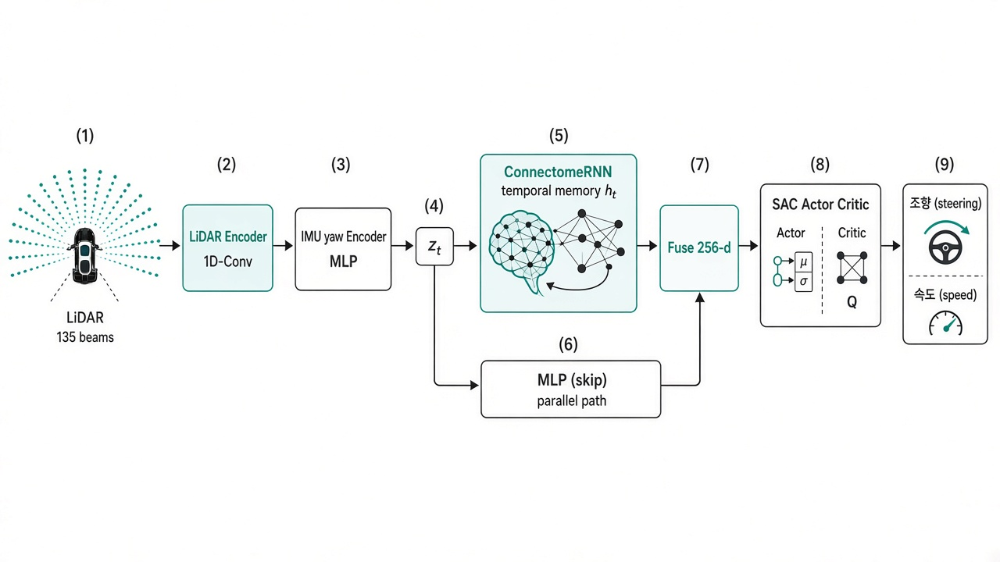
</p>

**흐름:** LiDAR·IMU → 인코더 → ConnectomeRNN(시간 메모리) ‖ skip → Fuse → SAC → 조향·속도  
배포: `/scan`(+yaw) → 같은 정책 → `/drive` (맵/센터라인 불필요)

---

## 1. 한 줄 요약

| 질문 | 답 |
|------|----|
| 무엇을 풀나? | **맵 없이** LiDAR(+yaw)만으로 F1TENTH 트랙 주행 |
| 센터라인? | **관측 ❌ / 보상·랩 채점 ✅** (privileged). 실차 불필요 |
| 왜 SAC? | 연속 행동 + off-policy |
| 커넥톰? | LSTM 자리의 **고정 배선 RNN 메모리** |
| Physical AI? | ST 슬립/μ + Roboracer 조향·\(a_{lat}\)·가속 제원 |
| Jetson? | `device=cuda`, dense matmul, 배치 인코딩 |

### 타이밍 (실차 정렬 · 학습 안정)

| | 값 | 이유 |
|--|-----|------|
| LiDAR 주기 | **40 Hz** (`DT=0.025`) | 실차 측정 주기 |
| 거리 상한 | **40 m** | 실차 range |
| 레이 샘플 | 맵 `resolution`(~5 cm) | 얇은 벽 관통 방지 |
| `frame_skip` | **4** → 제어 **~10 Hz** | 50→10 Hz로 행동 차이·히스토리 정보량 확보 |
| 히스토리 5프레임 | span ≈ **0.4 s** | skip 간격으로 스택 (예전 0.08 s) |
| 스폰 | CL 접선 헤딩 정렬 + 소량 횡노이즈 | 역헤딩 스폰·가짜 reverse 방지 |
| 랩 | `truncate` + 보너스 30 | Q 절벽 완화 |
| 보상 | ST progress + 슬립/\(a_y\)/조향급변 | Physical AI |
| 학습 저장 | `runs/*/best`(길이 우선), ckpt | EvalCallback length-aware |

A/B: **먼저** `train_sac_plain.py` (Eval deterministic). plain도 무너지면 env/SAC, plain만 안정이면 커넥톰.

---

## 학습 결과 (Spielberg · 실차 정렬 A/B)

실차 스펙 env (`40 m` LiDAR / `40 Hz` sim / 제어 `~10 Hz`)에서  
**plain MLP SAC 150k** 완료 + **connectome SAC ~80k** 저장 후 deterministic watch.

| 모델 | steps | 대표 seed0 랩 | 비고 |
|------|------:|---------------|------|
| plain MLP SAC | 150k | **101.7 s** 완주 | `plain_sac_f1tenth_Spielberg.zip` |
| connectome SAC | ~80k | **98.4 s** 완주 | `connectome_sac_f1tenth_Spielberg_80k.zip` (best도 랩 가능) |

<p align="center">
  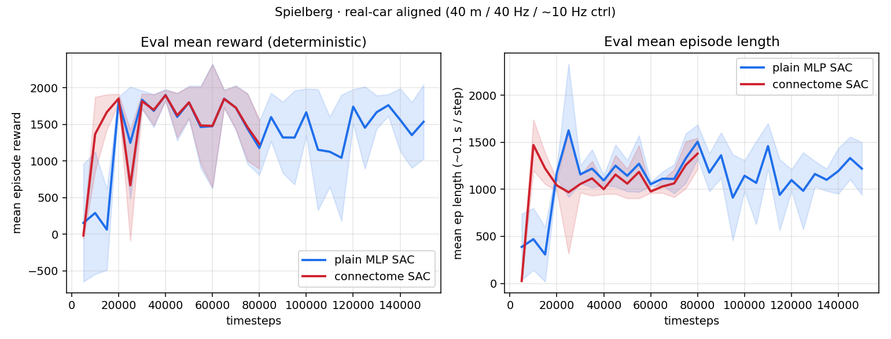
</p>

Deterministic eval: 두 모델 모두 ~10k 이후 **랩 완주 구간**(ep_len ≈ 1000–1500 ≈ 100–150 s)에 진입.  
connectome은 초반 상승이 더 가파름(10k에서 이미 랩). plain은 150k까지 안정적으로 유지.

| | plain last (seed0) | connectome 80k (seed0) |
|--|--------------------|------------------------|
| GIF |  | 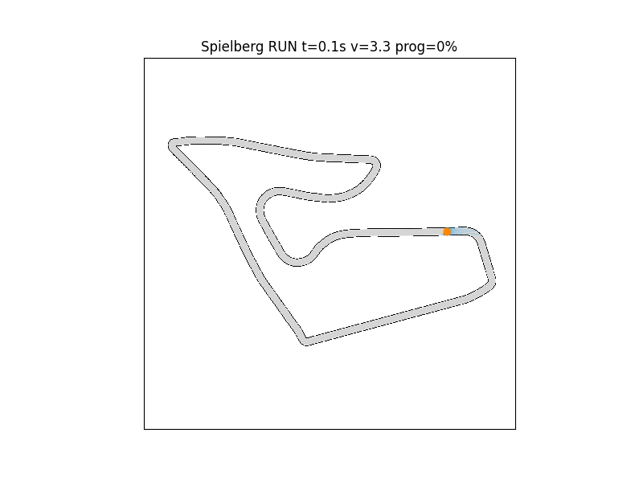 |
| traj | 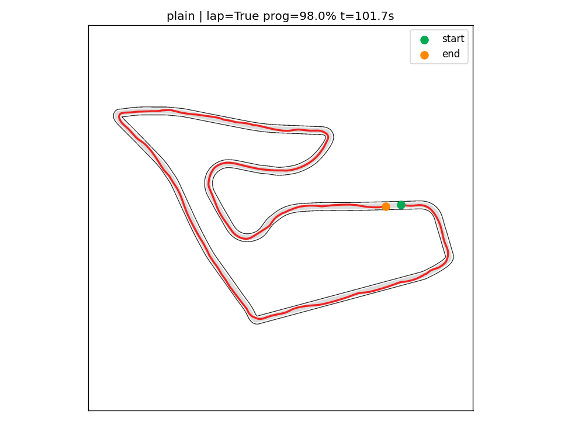 | 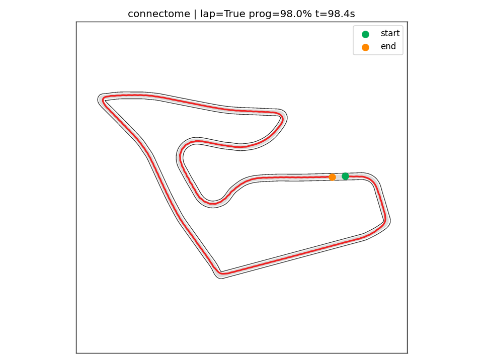 |

```powershell
# 결과 재현 (GIF + traj PNG)
python watch_sac_f1tenth.py --model plain_sac_f1tenth_Spielberg.zip --map Spielberg --plain --seed 0
python watch_sac_f1tenth.py --model connectome_sac_f1tenth_Spielberg_80k.zip --map Spielberg --use-cache --seed 0
python plot_sac_results.py   # → docs/figures/sac_ab_eval_curves.png
```

체크포인트: `runs/plain_Spielberg/`, `runs/connectome_Spielberg/` (gitignore). zip은 로컬 보관.

---

## Physical AI · Roboracer 제원 · 슬립

### Mapless 관측 vs privileged 센터라인 (헷갈리면 여기)

| | 정책(관측) | 시뮬 내부 |
|--|------------|-----------|
| LiDAR 135×5 + yaw×5 | ✅ | ✅ |
| 맵 occupancy | ❌ | 레이캐스트·충돌용 |
| **센터라인** | ❌ | 진행 \(\Delta s\), 랩, 스폰 정렬, CTE |
| 슬립각 β, \(a_y\) | ❌ (직접 안 줌) | 동역학 상태 + **보상 패널티** |

실차: `/scan`(+yaw)만 있으면 된다. CL CSV는 **학습 서버에서만** 쓴다.

### Roboracer-2026-main 에서 가져온 제원

| 항목 | 값 | 출처 |
|------|-----|------|
| 휠베이스 \(L\) | **0.33 m** | `vehicle_geometry.WHEELBASE_M` |
| 차체 반폭 | **0.15 m** (충돌 inflate) | `HALF_WIDTH_M` |
| 실측 전륜각 | **±0.3735 rad (±21.4°)** | `max_steering_angle_real_rad` |
| 횡가속 한계 \(a_{lat}\) | **6.0 m/s²** | `speed_profile.VEHICLE` |
| 가속 한계 | **7.0 m/s²** | 동상 `a_accel` |
| 감속(참고) | 4.0 m/s² | 제원에만; ST에 비대칭 브레이크는 아직 약함 |
| 학습 속도 밴드 | **`[2.0, 7.0]` m/s** | 커리큘럼 |

구현: `vehicle_dynamics.STParams.roboracer()` → \(\mu \approx a_{lat}/g \approx 0.61\),  
\(C_{Sf},C_{Sr}\)는 f1tenth_gym 식별값 유지.

### 동역학에서 **고려하는** 것 (ST)

- 타이어 **슬립각 β**, 요레이트, 횡가속 \(a_y \approx v\dot\psi\)
- 노면 마찰 **μ**, 코너링 강성, CG 높이(하중 이동 근사)
- 조향각·조향각속도 한계, 종가속 한계·고속 가속 감쇠
- \(v<0.5\)면 kinematic bicycle으로 전환
- RK4 + 5 ms 서브스텝, 명령은 PID → `(accl, steer_vel)`
- 보상: 진행 + **슬립/ \(a_y\) 초과 / 조향급변 / CTE** 패널티

### 아직 **약한/없는** 것

개별 휠·서스펜션, 종방향 슬립(록), 브레이크≠가속 비대칭, 서보 지연,  
μ 맵, 모터/VESC 전류, 차체 스윕 충돌(현재 점+반폭). → Isaac Sim 후속 후보.

### 속도 커리큘럼 · 현재 학습

```text
v_cmd = min_speed + action_speed * (max_speed - min_speed)
```

| 단계 | 물리 | 속도 | 상태 |
|------|------|------|------|
| 1 | kinematic | `[2, 3.5]` | 데모 zip (`*_80k`, `*_v35.bak`) — 안정 랩 |
| **2 (현재)** | **ST + Roboracer 제원** | **`[2, 7]`** | plain `…_st27` / `runs/plain_Spielberg/` |

```powershell
python train_sac_plain.py --map Spielberg --timesteps 200000 --fresh `
  --min-speed 2 --max-speed 7 --max-steer 0.3735 --physics st `
  --save-path plain_sac_f1tenth_Spielberg_st27.zip
```

스폰은 CL **접선 방향으로 헤딩 정렬**. 역주행 terminate는 **유예+연속 프레임**으로  
가짜 reverse 학살을 줄였다.

### 전이 맵 (본인 Cartographer / IFAC)

| 맵 | alias | kinematic 3.5 zero-shot | ST 7 zero-shot |
|----|-------|-------------------------|----------------|
| ajou | `ajou` | 예전에 랩 가능 | 재평가/파인튜닝 권장 |
| IFAC | `ifac` | zero-shot 실패(벽) | 파인튜닝 필요 |

```powershell
python watch_sac_f1tenth.py --model connectome_sac_f1tenth_Spielberg_80k.zip `
  --map ajou --use-cache --seed 0 --min-speed 2 --max-speed 3.5
```

---

## ST Physical AI A/B — plain vs connectome (~80k best)

동일 env: Spielberg · ST · \(v\in[2,7]\) · 조향 ±0.3735 · \(\mu\approx0.61\) · \(a_{lat}=6\).

| 모델 | 체크포인트 |
|------|------------|
| plain | `runs/plain_Spielberg/best/best_model.zip` |
| connectome | `connectome_sac_f1tenth_Spielberg_st27_best.zip` (≈60–80k best) |

재현:

```powershell
python compare_st_ab.py
# → docs/figures/st27_plain_vs_connectome.json
# → docs/figures/sac_st27_{plain,conn}_best_Spielberg.gif (+ traj PNG)
```

### 주행 비교 (deterministic)

**랜덤 스폰 seed 0–11**

| | plain | connectome |
|--|------:|-----------:|
| 랩 | 0/12 | 0/12 |
| 평균 progress | 0.09 | **0.16** |
| 최대 progress | 0.20 | **0.78** (seed7) |
| crash / reverse | 8 / 4 | 5 / 7 |
| 평균 생존 t | 10.1 s | **15.1 s** |
| slip_max 평균 | 0.20 | 0.24 |

**정렬 출발 (CL 접선, idx=10) — 공정 비교**

| | plain | connectome |
|--|------:|-----------:|
| 결과 | **93%에서 crash** | **랩 완주** (~53 s) |
| progress | 0.93 | **0.98** |
| v_mean / v_max | 5.98 / 6.97 | **6.40 / 6.91** |
| slip_mean / max | 0.053 / 0.66 | 0.059 / 0.62 |
| ay_mean | 3.61 | **2.58** (더 낮음) |

| plain | connectome |
|-------|------------|
|  | 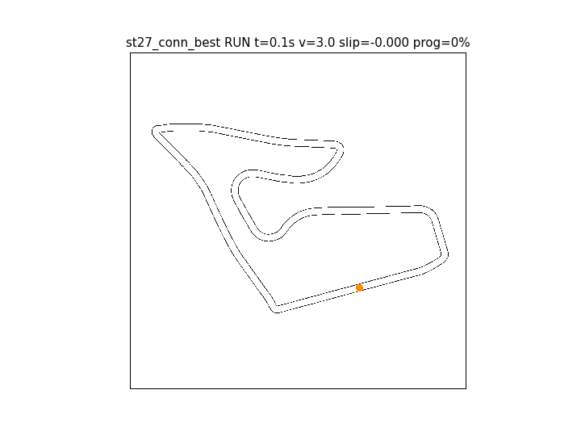 |
| 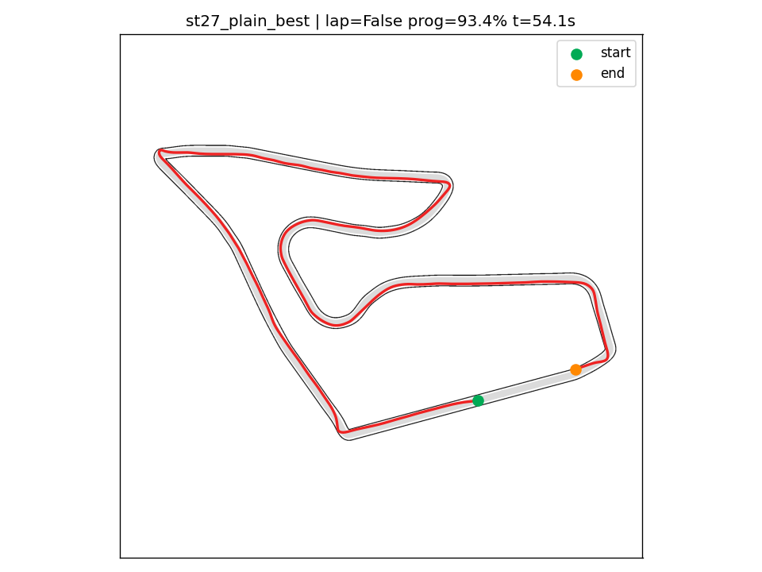 |  |

**해석:** 스폰이 엉망이면 둘 다 자주 죽음(역주행 terminate 포함).  
**헤딩만 맞추면** 이 시점에서는 connectome best가 랩을 끝까지 가져가고, plain은 거의 다 와서 벽에 붙는다.  
속도는 둘 다 ~7 근처까지 쓰지만, 성공 랩에서 connectome의 평균 \(a_y\)가 더 낮아 **고속 유지 + 횡가속 폭주가 덜한** 쪽에 가깝다.

### 레이어 활성화 — 어디가 유리한가

| | plain GIF | connectome GIF |
|--|-----------|----------------|
| 파일 | `policy_layers_activation_st_plain.gif` | `policy_layers_activation_st_connectome.gif` |
| 보는 것 | Actor **h1/h2 ReLU** + slip/ay/v | Encoder \(z\) · **Connectome \(\|h\|\)/DN** · fuse |

<p align="center">
  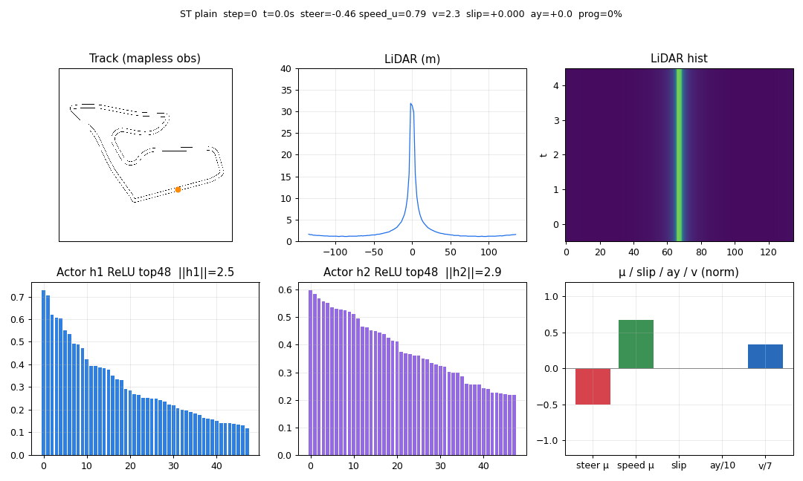
  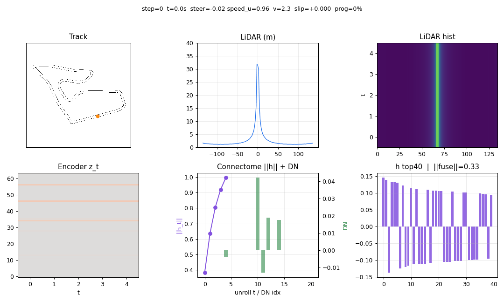
</p>

| 상황 | 더 유리해 보이는 쪽 | 이유 |
|------|---------------------|------|
| **코너 진입·장면 급변** | **connectome** | \(z\) 변화 뒤 \(\|h\|\)/DN이 시간에 걸쳐 쌓임 → 5프레임 스택만 있는 plain보다 **짧은 시간 맥락**을 명시적으로 유지 |
| **직진·단순 벽 회피** | **plain도 충분** | h1/h2가 LiDAR 패턴에 바로 반응; 커넥톰 이득이 작음 |
| **랩 마무리(정렬 스폰)** | **connectome (이번 best)** | 동일 출발에서 완주 vs plain 93% crash |
| **학습 벽시계 / 디버그** | **plain** | CPU fps ~3×, 구조 단순 |
| **슬립·\(a_y\) 모니터링** | 둘 다 | GIF 제목줄 `slip`/`ay` — **물리 자체는 공유 ST** |

한 줄: **Physical AI 물리에서는 “메모리가 필요할 때” connectome이 유리하고, 단순 회피·빠른 실험은 plain이 유리.**  
본선 스토리용으로 connectome ST를 이어 학습 중(`…_st27.zip`, 200k 목표). plain은 베이스라인으로 유지.

```powershell
# 레이어 GIF 재생성
python viz_policy_layers_plain_gif.py --model runs/plain_Spielberg/best/best_model.zip `
  --physics st --min-speed 2 --max-speed 7 --max-steer 0.3735 --start-idx 10 `
  --out docs/figures/policy_layers_activation_st_plain.gif

python viz_policy_layers_gif.py --model connectome_sac_f1tenth_Spielberg_st27_best.zip `
  --use-cache --physics st --min-speed 2 --max-speed 7 --max-steer 0.3735 --start-idx 10 `
  --out docs/figures/policy_layers_activation_st_connectome.gif
```

---

## 2. 모듈 개념 설명 (초심자용)

### 2.1 왜 “인코더”가 필요한가?

LiDAR 한 프레임은 **135개 거리값**. 매 스텝 이걸 그대로 거대한 MLP에 넣으면:

- 파라미터·노이즈가 많고  
- “왼쪽 벽 / 전방 갭” 같은 **국소 패턴**을 매번 처음부터 배워야 함  

**인코더** = 센서 → **의미 있는 짧은 특징 벡터** \(z\).  
CNN/MLP가 “가까운 빔끼리의 패턴”을 먼저 뽑아주면, 뒤의 커넥톰·SAC가 주행만 배우기 쉬워진다.

### 2.2 LiDAR Encoder (1D Conv)

<p align="center">
  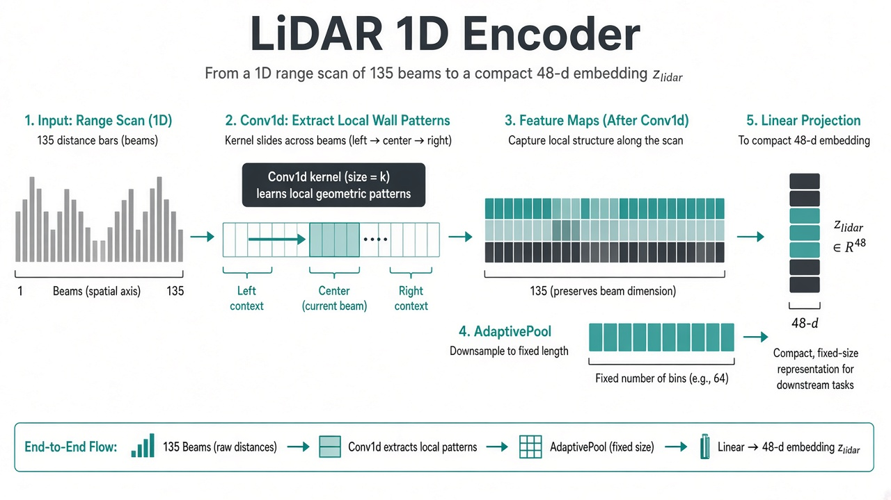
</p>

| 개념 | 설명 |
|------|------|
| 입력 | 빔 배열 \(d\in\mathbb{R}^{135}\) (거리/10으로 정규화) |
| **축의 의미** | 이미지가 아니라 **각도 방향의 1D 신호**. 옆 빔 = 비슷한 시야 |
| Conv1d | 작은 커널이 빔을 따라 미끄러지며 **국소 벽·갭 패턴** 추출 |
| Pool + Linear | 길이를 줄여 \(z_{\mathrm{lidar}}\in\mathbb{R}^{48}\) |
| 구현 | `policy_sac_connectome.py` → `LidarEncoder` |
| GPU | **5프레임을 한 번에** `(B·T, 1, 135)` 배치 Conv → GPU 점유↑ |

직관: “사진용 2D CNN”의 1D 버전. 전방 중앙이 막히면 중앙 채널 활성, 한쪽 벽이면 좌/우 패턴.

### 2.3 IMU Encoder (MLP)

| 개념 | 설명 |
|------|------|
| 입력 | yaw rate \(\tilde\omega=\mathrm{clip}(\dot\theta/3,-1,1)\) (히스토리 5칸) |
| 역할 | “지금 얼마나 회전 중인지”를 짧은 벡터로 |
| 출력 | \(z_{\mathrm{imu}}\in\mathbb{R}^{16}\) |
| 합치기 | \(z_t = [z_{\mathrm{lidar}}; z_{\mathrm{imu}}]\in\mathbb{R}^{64}\) |

LiDAR만으로도 회전은 추정 가능하지만, yaw를 직접 주면 **고속 코너**에서 신호가 더 또렷하다.

### 2.4 ConnectomeRNN = 시간 메모리 (LSTM 자리)

<p align="center">
  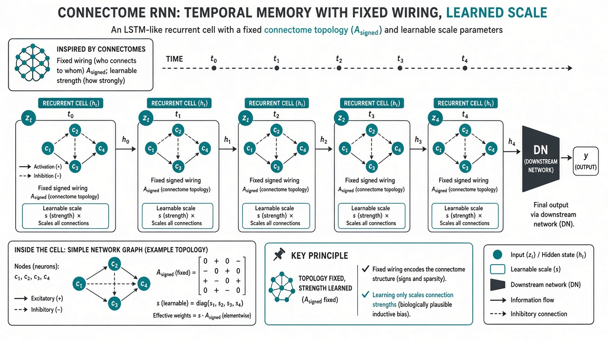
</p>

| 개념 | 설명 |
|------|------|
| 왜 메모리? | 한 프레임만 보면 POMDP (속도·곡률 변화 모호) |
| 히스토리 스택 | obs에 이미 5프레임 포함 |
| **RNN unroll** | \(t=0..4\) 순서로 \(h\)를 넘기며 갱신 (LSTM 셀 대신 **초파리 배선**) |
| 고정 | \(A_{\mathrm{signed}}\) — 누가 누구와 연결되는지 |
| 학습 | \(\mathrm{scale}\) (세기), \(W_{\mathrm{in}}\) (입력 주입) |
| 출력 | DN 활성 \(y_4\) → “행동 관련 요약” |

수식 (leaky rate RNN):

\[
W_{\mathrm{eff}}=A_{\mathrm{signed}}\odot\mathrm{scale}\odot M_{\mathrm{topo}}
\]

\[
h \leftarrow h + \frac{\Delta t}{\tau}\Big(-h + \tanh(W_{\mathrm{eff}}^\top h + \mathrm{drive}(z))\Big)
\]

**LSTM과 비교**

| | LSTM | ConnectomeRNN (본 레포) |
|--|------|-------------------------|
| 구조 | 학습된 게이트 | **생물 배선 prior** |
| 새 연결 | 자유롭게 생김 | **금지** (토폴로지 고정) |
| 역할 | 시계열 압축 | 동일 + 해석 가능한 prior |

### 2.5 skip MLP · Fuse · SAC

| 모듈 | 하는 일 |
|------|---------|
| **skip** | \(z\) 평균을 MLP로 바로 보냄 — 커넥톰이 흔들려도 주행 학습 경로 유지 |
| **fuse** | `[skip; DN]` → 256차원 공통 feature |
| **SAC Actor** | feature → 조향·속도 분포 |
| **SAC Critic** | feature+action → soft Q |

SAC 목표 (최대 엔트로피):

\[
J(\pi)=\mathbb{E}\Big[\sum_t \gamma^t\big(r_t+\alpha\mathcal{H}(\pi(\cdot|s_t))\big)\Big]
\]

### 2.6 레이어 활성화 시각화

중간 활성화를 찍어 **정책이 장면에 반응하는지** 본다.  
모델 종류에 따라 패널이 다르다.

#### A) Connectome (kinematic 데모 zip)

| 산출물 | 파일 |
|--------|------|
| PNG | `docs/figures/policy_layers_activation.png` |
| GIF (길게) | `docs/figures/policy_layers_activation.gif` |

<p align="center">
  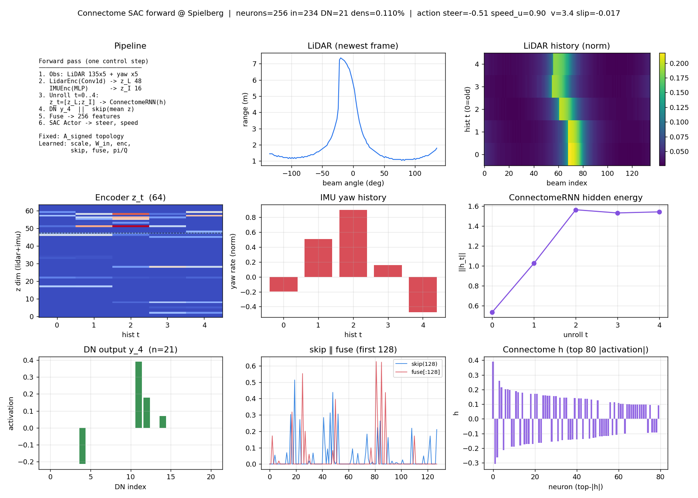
</p>

<p align="center">
  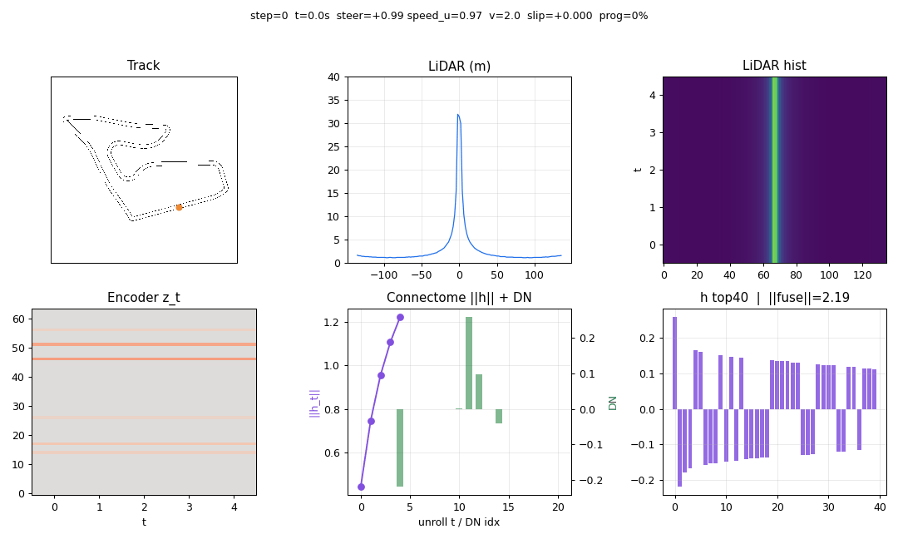
</p>

```text
Obs 680 → LidarEnc/IMUEnc → z_t
       → ConnectomeRNN unroll (A_signed 고정, scale/W_in 학습)
       → h_t, y_DN ‖ skip(z) → Fuse → Actor (steer, speed)
```

| 패널 | 의미 |
|------|------|
| Track / LiDAR / hist | 장면 (맵은 **표시용**; 관측은 LiDAR만) |
| Encoder \(z_t\) | 장면 압축이 시간에 따라 바뀌는지 |
| \(\|h\|\) + DN | 커넥톰 메모리·출구 활성 |
| \(h\) top40 / fuse | SAC에 들어가는 요약 |

**뜻함:** LiDAR→\(z\)→\(h\)가 장면과 같이 변하면 커넥톰 경로가 쓰이는 **정성 증거**.  
**뜻하지 않음:** top-k 뉴런 = 해부학 라벨이 아님.

#### B) Plain ST Physical AI (현재 학습 체크포인트)

커넥톰이 없는 MLP라 **Actor h1/h2 ReLU** + **slip / \(a_y\) / \(v\)** 를 본다.

| 산출물 | 파일 |
|--------|------|
| GIF | `docs/figures/policy_layers_activation_st_plain.gif` |

<p align="center">
  
</p>

모델 예: `runs/plain_Spielberg/best/best_model.zip` (ST `[2,7]`, Roboracer 제원).  
제목줄에 `slip`, `ay`가 보이면 **슬립 동역학이 시뮬에 살아 있는 상태**다.

#### 재생 커맨드

```powershell
# Connectome kinematic 데모
python viz_policy_layers.py --model connectome_sac_f1tenth_Spielberg_80k.zip `
  --map Spielberg --use-cache --min-speed 2 --max-speed 3.5
python viz_policy_layers_gif.py --model connectome_sac_f1tenth_Spielberg_80k.zip `
  --map Spielberg --use-cache --max-steps 400 --stride 2 --physics kinematic `
  --min-speed 2 --max-speed 3.5 --out docs/figures/policy_layers_activation.gif

# Plain ST Physical AI
python viz_policy_layers_plain_gif.py `
  --model runs/plain_Spielberg/best/best_model.zip `
  --physics st --min-speed 2 --max-speed 7 --max-steer 0.3735 `
  --max-steps 400 --stride 2 --seed 7 `
  --out docs/figures/policy_layers_activation_st_plain.gif
```

GIF는 `--start-idx`로 CL에 **헤딩 정렬**된 출발을 쓴다 (관측에 CL을 넣는 것이 아님).

---

## 3. GPU / Jetson 설계

나중에 **Jetson에 올려 GPU를 쓰게** 맞춘 포인트:

| 항목 | CPU | GPU (CUDA / Jetson) |
|------|-----|---------------------|
| Connectome matmul | **sparse** (희소 연결) | **dense** \(h W^\top\) — Tensor 코어에 유리 |
| LiDAR 인코딩 | 프레임 루프도 가능 | **B×T 배치 Conv1d** 한 방 |
| SAC batch | 256 | 기본 **512** (`--batch-size`) |
| cuDNN | — | `cudnn.benchmark=True` |
| 디바이스 | `--device cpu` | `--device cuda` 또는 `auto` |

```bash
# Jetson / CUDA PC
python train_sac_connectome.py --use-cache --map Spielberg --device cuda \
  --max-neurons 256 --batch-size 512 --n-envs 4 --timesteps 300000 --fresh

# 추론도 동일 zip, device=cuda
```

**주의:** 시뮬 env(레이캐스트)는 아직 CPU. **정책 forward/backward만 GPU**.  
Jetson에서는 env step이 짧고 배치 추론이 잦을수록 GPU 비율이 커진다.  
추후: TensorRT / `torch.jit` / ONNX로 추론만 더 가속 가능.

---

## 4. 이론 요약 (MDP · 보상)

### MDP

| 기호 | 내용 |
|------|------|
| \(s\) | LiDAR hist + yaw hist (맵 없음) |
| \(a\) | \([a^{\mathrm{steer}}, a^{\mathrm{speed}}]\) |
| \(r\) | 시뮬: CL progress (privileged) |
| \(\gamma\) | 0.99 |

### 관측 레이아웃 (680)

```text
[ LiDAR t-4 … t ][ yaw × 5 ]
     675              5
```

### 보상 (privileged · ST Physical AI)

관측에는 CL이 없고, 보상만 CL 진행을 쓴다 (`reward_mode=privileged_progress_st_roboracer_v2`).

대략:

\[
\begin{aligned}
r &\approx 5\max(\Delta s,0) - 1\max(-\Delta s,0)
  + 0.15\max(\Delta s,0)\,v_{\mathrm{norm}}\\
  &\quad - 0.6\max(|\beta|-0.04,0) - 0.05\max(|a_y|-0.85 a_{\mathrm{lat}},0)\\
  &\quad - 0.04\,\dot\delta_{\mathrm{cmd}} - 0.12\max(\mathrm{CTE}-0.55,0)
\end{aligned}
\]

충돌 \(-10\), 랩 \(+30\) (truncate).  
역주행은 스폰 유예 후 **연속 프레임**일 때만 terminate.

**실차 추론에는 센터라인 불필요.**

### 제어 · 동역학

\[
\delta=a_0\delta_{\max},\quad
v^{\mathrm{cmd}}=v_{\min}+a_1(v_{\max}-v_{\min})
\]

기본: \(v\in[2,7]\), \(\delta_{\max}=0.3735\) (실측), ST RK4,  
\(\Delta t=0.025\) (40 Hz), `frame_skip=4` → 제어 ~10 Hz, \(L=0.33\).

---

## 5. 정책 의사코드

```text
# GPU: LidarEnc/IMUEnc on all frames batched
Z = EncodeAllFrames(lidar[B,T,135], yaw[B,T])   # → z[B,T,64]

h = 0
for t in 0..4:
    y, h = ConnectomeRNN(z[:,t], h)             # CUDA: dense W

feat = Fuse( Skip(mean_t z) , y_DN )
a ~ Actor(feat)                                 # SAC
```

| 모듈 | 학습 |
|------|------|
| LidarEnc, IMUEnc | ✅ |
| \(A_{\mathrm{signed}}\) | ❌ 고정 |
| scale, \(W_{\mathrm{in}}\) | ✅ |
| skip, fuse, π, Q | ✅ |

`--freeze-connectome`: 커넥톰 미학습 ablation.

---

## 6. 학습 커맨드 · 하이퍼

| 항목 | 기본 |
|------|------|
| `max_neurons` | 256 |
| `device` | `auto` → cuda 우선 |
| `batch_size` | CUDA 512 / CPU 256 |
| `train_freq` / `grad_steps` | 4 / 4 |
| `learning_starts` | 3000 |
| `target_entropy` | **-2.0** (행동 dim=2) |

```powershell
# Physical AI plain (권장 베이스라인)
python train_sac_plain.py --map Spielberg --timesteps 200000 --fresh `
  --device auto --min-speed 2 --max-speed 7 --max-steer 0.3735 --physics st `
  --save-path plain_sac_f1tenth_Spielberg_st27.zip

# Connectome (plain 안정 후)
python train_sac_connectome.py --use-cache --map Spielberg --timesteps 200000 --fresh `
  --device auto --max-neurons 256 --min-speed 2 --max-speed 7 --max-steer 0.3735 --physics st
```

| 로그 | 의미 |
|------|------|
| `ep_len_mean` | 생존 (×0.1≈초 @10 Hz) **1순위** |
| `eval/mean_ep_length` | deterministic 길이 (best 저장 기준) |
| `ep_rew_mean` | 보상 합 (식 바꾸면 비교 금지) |
| `fps` | CPU env 병목 시 낮을 수 있음 |
| `[lap]` | 완주 |

---

## 7. 파일 지도

| 경로 | 역할 |
|------|------|
| `docs/figures/*.png` / `*.gif` | 구조·A/B·**레이어 활성화**(connectome / ST plain) |
| `f1tenth_mapless_env.py` | Gym: mapless obs + privileged reward + ST/kinematic |
| `vehicle_dynamics.py` | ST RK4, `STParams.roboracer()` |
| `policy_sac_connectome.py` | 인코더 + connectome + `forward_intermediates` |
| `connectome_rnn.py` | leaky RNN (CUDA dense / CPU sparse) |
| `train_sac_plain.py` / `train_sac_connectome.py` | 학습 (`--physics`, `[2,7]`, steer 0.3735) |
| `watch_sac_f1tenth.py` | 주행 GIF + traj |
| `compare_st_ab.py` | ST plain vs connectome 시드/정렬 A/B + GIF |
| `viz_policy_layers_plain_gif.py` | ST plain h1/h2 + slip/ay GIF |
| `viz_policy_layers_gif.py` | connectome \(z\)/\(h\)/DN GIF |
| `docs/figures/st27_plain_vs_connectome.json` | A/B 수치 요약 |
| `docs/figures/sac_st27_*` | ST A/B 주행 GIF·궤적 |
| `docs/figures/policy_layers_activation_st_*.gif` | ST 레이어 활성화 |

---

## 8. 설치 · Jetson 메모

```powershell
pip install -r requirements.txt
# CUDA wheel: 환경에 맞는 torch 설치 (Jetson은 NVIDIA 문서의 PyTorch wheel)
python -c "import torch; print(torch.cuda.is_available(), torch.cuda.get_device_name(0))"
```

hemibrain: `download_hemibrain.py` 후 `--use-cache`. 토큰 깃 금지.

실차:

```text
Roboracer: /scan → Stanley → /drive
본 레포:   /scan(+yaw) → 정책(cuda) → /drive
```

---

## 9. 권장 순서

1. Env 스모크 `python f1tenth_mapless_env.py`  
2. **plain ST** `[2,7]` — `ep_len`↑ · `[lap]` 확인  
3. ST plain 레이어 GIF (`viz_policy_layers_plain_gif.py`)  
4. connectome ST 같은 제원으로 A/B  
5. ajou / IFAC fine-tune  
6. (후속) Isaac Sim 검증 · Jetson `/drive`  

---

## 10. 한계 · FAQ

- **Mapless = 관측**. 센터라인은 보상용 privileged일 뿐.  
- 슬립은 ST β + 보상 패널티로 반영. 종슬립·서스펜션은 없음.  
- 5프레임 메모리 ≠ 에피소드 전체 LSTM  
- env 물리/레이캐스트 CPU — 정책만 GPU  
- zip / cache / `runs/` / `watch_out*` gitignore  
- 레이어 GIF top-k ≠ 해부학 라벨  

**Q. 센터라인 넣으면 mapless 아니잖아?**  
A. 관측에는 안 넣습니다. 학습 서버만 CL로 \(\Delta s\)/랩을 계산합니다. 실차는 LiDAR만.

**Q. 슬립 고려했어?**  
A. 네. ST 상태 β와 \(a_y\), 보상 패널티. GIF 제목줄 `slip`/`ay`로 확인 가능.

**Q. 커넥톰이 LSTM인가요?**  
A. 역할은 같고, 구조는 고정 초파리 배선 + 학습 scale입니다.

**Q. Isaac Sim?**  
A. 다음 스테이지로 적합. 지금은 Gym ST로 랩 안정화가 우선.

---

## 11. 다음 설계 — 40 Hz · 레이싱라인 Asymmetric SAC

> **상태: 1차 구현 완료 → 코드·사용법은 [§12](#12-mapless40--40-hz-asymmetric-sac-테스트-버전).** 목표는 localization 없는 **mapless end-to-end** 주행.
> 레이싱라인은 **보상·critic(학습 전용)** 에만 쓰고, 배포되는 actor 입력은 LiDAR + 자기상태뿐이다.
> 모방학습이 아닌 **순수 RL**: 정답 행동을 따라 하지 않고, critic만 privileged 정보를 본다.

### 11.0 현재 구조와 차이

| | 현재 (§1–§10) | 다음 설계 |
|--|--|--|
| 제어 주기 | frame_skip 4 → **10 Hz** | frame_skip 1 → **40 Hz** (LiDAR 주기) |
| 히스토리 | 0.1 s 간격 5장, 지연 0 | 스캔 **n-4…n-1** 4장 → 명령 $a_n$ (1틱 지연) |
| 관측 | LiDAR 135빔 + yaw | LiDAR **1125빔(0.24°, 15 m)** + **속도 + yaw + 직전 명령 + Δt** |
| 시간 결합 | `z.mean(dim=1)` (순서 소실) | **concat** (순서 유지) 또는 GRU/커넥톰 |
| 보상 기준 | 센터라인 progress + CTE 벌점 | **레이싱라인** progress + 횡오차 + 목표속도 |
| critic 입력 | actor와 동일 | actor 입력 + **privileged** $p_n$ |
| $\gamma$ | 0.99 | $0.99^{1/4} \approx 0.9975$ |

### 11.1 타이밍 (1틱 지연)

```text
스캔:   ... d_{n-4}  d_{n-3}  d_{n-2}  d_{n-1} | d_n ...
                └──────── o_n ────────┘
명령:                           a_n 계산 → [n, n+1] 구간(25 ms)에 적용
```

실차 계산 지연과 같은 구조이므로, 관측에 직전 명령 $a_{n-1}$을 넣어 Markov 성질을 유지한다.

### 11.2 입력

**Actor 관측 $o_n$** (실차에서 그대로 얻을 수 있음)

```math
d_k=\mathrm{clip}\!\left(\frac{r_k}{15},0,1\right)\in\mathbb{R}^{1125},\qquad k=n-4,\dots,n-1
```

```math
q_n=\Big[\tfrac{\bar v_{n-4:n-1}}{7},\ \mathrm{clip}\!\big(\tfrac{\bar\omega_{n-4:n-1}}{3}\big),\ \tfrac{\omega_{\text{latest}}}{3},\ a_{n-2},\ a_{n-1},\ \tfrac{\Delta t_{n-4:n-1}-0.025}{0.025}\Big]\in\mathbb{R}^{17}
```

LPX-T1 @ 40 Hz: 60 kHz / 40 Hz = 1500점/회전 → 0.24° → 270° 안 1125빔. 반사율 10% 한계 15 m 에서 자르고, 같은 격자칸에 여러 빔이 오면 **최소값**.
$\bar v$: 바퀴속도(VESC 50 Hz) 구간 평균, $\bar\omega$: yaw rate(IMU 100 Hz) 구간 평균, $a$: 직전 명령 (δ, v_cmd) 2개, $\Delta t$: 스캔 간격.

**Critic 추가 입력 $p_n$** (시뮬 전용 privileged)

```math
p_n=\Big[e_y,\ e_\psi,\ v_n-v_{\mathrm{ref}}(s_n),\ \beta,\ \{\kappa(s_n+j\Delta)\}_{j=1}^{K},\ \{v_{\mathrm{ref}}(s_n+j\Delta)\}_{j=1}^{K}\Big]
```

| 기호 | 의미 |
|--|--|
| $s_n$ | 레이싱라인 위 진행거리 |
| $e_y,\ e_\psi$ | 레이싱라인 기준 횡오차 · 헤딩오차 |
| $\kappa,\ v_{\mathrm{ref}}$ | 곡률 · Roboracer 제원으로 **재계산한** 목표속도 |
| $\beta$ | 슬립각 |
| $\Delta, K$ | 예: 1 m, 10 → $p_n\in\mathbb{R}^{24}$ |

> 레이싱라인: `f1tenth_racetracks/<Track>/<Track>_raceline.csv` (`;` 구분, `s,x,y,ψ,κ,vx,ax`).
> 이 라인은 점 차량 기준이라 벽에서 0.1~0.3 m 까지 붙는다 → 거리장 기울기로 **벽에서 0.45 m 이상** 밀어낸 뒤 사용.
> `vx`는 쓰지 않고 $a_{lat}=5$, **타력 감속 모델**(능동 제동 없음)로 다시 계산.

### 11.3 Actor (배포 네트워크)

**① LiDAR 인코더** (4장 가중치 공유)

```math
\begin{aligned}
e^{(1)}_k &= \mathrm{ReLU}\big(\mathrm{Conv1d}_{1\to32,\;k5,\;s2,\;p2}(d_k)\big) &&\in\mathbb{R}^{32\times563}\\
e^{(2)}_k &= \mathrm{ReLU}\big(\mathrm{Conv1d}_{32\to64,\;k5,\;s2,\;p2}(e^{(1)}_k)\big) &&\in\mathbb{R}^{64\times282}\\
e^{(3)}_k &= \mathrm{ReLU}\big(\mathrm{Conv1d}_{64\to64,\;k5,\;s2,\;p2}(e^{(2)}_k)\big) &&\in\mathbb{R}^{64\times141}\\
g_k &= \mathrm{flatten}\big(\mathrm{AvgPool}_{\to8}(e^{(3)}_k)\big) &&\in\mathbb{R}^{512}\\
z_k &= \mathrm{ReLU}(W_z g_k+b_z) &&\in\mathbb{R}^{48}
\end{aligned}
```

Conv 길이: $\lfloor (L+4-5)/2\rfloor+1$ → $1125\to563\to282\to141$.
대안 인코더(`--encoder bev`): IMU·속도로 4프레임을 현재 차 기준에 정렬해 150×150 격자(10 cm)에 찍고 Conv2d×4 → 192.

**② 시간 결합** (평균 금지, 순서 유지)

```math
Z_n=\big[z_{n-4};\,z_{n-3};\,z_{n-2};\,z_{n-1}\big]\in\mathbb{R}^{192}
```

(선택) 순환 메모리 — $k=n-4,\dots,n-1$ 순으로 갱신하고 $[Z_n;\,y]$를 다음 단계로:

```math
\text{GRU:}\quad h_k=\mathrm{GRU}(z_k,\,h_{k-1})
```

```math
\text{커넥톰:}\quad h_k=h_{k-1}+\frac{\Delta t}{\tau}\Big(-h_{k-1}+\tanh\big(h_{k-1}W_{\mathrm{eff}}+D(z_k)\big)\Big),\qquad W_{\mathrm{eff}}=A_{\mathrm{signed}}\odot\mathrm{scale}\odot M
```

$A[\mathrm{pre},\mathrm{post}]$ 이므로 **전치 없이** $h\,W_{\mathrm{eff}}$ (예전 CUDA 경로 `h @ W_eff.t()`는 방향이 반대였음 — `connectome_rnn.py` 수정 완료).
$D(z_k)$: 입력 뉴런 위치에만 $W_{in}z_k$, 출력 $y=h_{n-1}[\mathrm{DN}]$.

**③ 자기상태 인코더**

```math
u_n=\mathrm{ReLU}(W_q q_n+b_q)\in\mathbb{R}^{32},\qquad W_q\in\mathbb{R}^{32\times17}
```

**④ Fuse**

```math
f=\mathrm{ReLU}\Big(W_2\,\mathrm{ReLU}\big(W_1[Z_n;\,u_n]+b_1\big)+b_2\Big)\in\mathbb{R}^{256}\qquad(\text{입력 }224)
```

**⑤ Squashed Gaussian 출력**

```math
\mu=W_\mu f+b_\mu,\qquad \log\sigma=\mathrm{clip}(W_\sigma f+b_\sigma,\,-20,\,2)
```

```math
\xi\sim\mathcal{N}(0,I),\qquad u=\mu+\sigma\odot\xi,\qquad \tilde a=\tanh(u)\in(-1,1)^2
```

```math
\log\pi(\tilde a\,|\,o)=\sum_{i=1}^{2}\Big[\log\mathcal{N}(u_i;\mu_i,\sigma_i)-\log\big(1-\tanh^2(u_i)+\epsilon\big)\Big]
```

배포 시 $\xi=0$ → $\tilde a=\tanh(\mu)$.

**⑥ 물리 명령**

```math
\delta_{\mathrm{cmd}}=\tilde a_1\,\delta_{\max},\qquad v_{\mathrm{cmd}}=v_{\min}+\frac{\tilde a_2+1}{2}\,(v_{\max}-v_{\min})
```

$\delta_{\max}=0.3735$ rad, $v\in[1.5,7]$ m/s.

### 11.4 Critic (학습 전용, $Q_1,Q_2$ + target)

```math
c_n=\big[\mathrm{Enc}_c(o_n);\,p_n\big],\qquad Q_i(o_n,p_n,a)=W_3\,\mathrm{ReLU}\Big(W_2\,\mathrm{ReLU}\big(W_1[c_n;\,a]\big)\Big)
```

차원: $192+32+24+2=250\to256\to256\to1$. $\mathrm{Enc}_c$는 ①–③과 같은 구조, critic 전용 가중치.
**critic만 $p_n$을 본다** — actor 입력에는 없음.

### 11.5 보상 (틱 단위, $\Delta t=0.025$ s)

```math
r_n = w_s\,\Delta s_n \;-\; w_y\,e_y^2\,\Delta t \;-\; w_v\,(v_n-v_{\mathrm{ref}})^2\,\Delta t \;-\; w_\delta\,|\delta_n-\delta_{n-1}| \;-\; w_\beta\,\max(|\beta|-0.04,\,0)\,\Delta t
```

충돌 시 $r=-C$ 후 종료. 시간 비례 항에 $\Delta t$를 곱해 제어 주기를 바꿔도 크기가 유지되게 한다.

### 11.6 손실

**Critic (soft Bellman)**

```math
y=r_n+\gamma(1-\mathrm{done})\Big[\min_{j=1,2}\bar Q_j(o_{n+1},p_{n+1},a')-\alpha\log\pi(a'\,|\,o_{n+1})\Big],\qquad a'\sim\pi(\cdot\,|\,o_{n+1})
```

```math
\mathcal{L}_Q=\mathbb{E}\Big[\sum_{i=1,2}\big(Q_i(o_n,p_n,a_n)-y\big)^2\Big]
```

**Actor**

```math
\mathcal{L}_\pi=\mathbb{E}_{o,p,\xi}\Big[\alpha\log\pi(\tilde a\,|\,o_n)-\min_{j}Q_j(o_n,p_n,\tilde a)\Big]
```

기울기: $Q\to\tilde a\to(\mu,\sigma)\to f\to$ 인코더. critic이 레이싱라인을 알고 있으므로 그 가치 신호가 LiDAR만 보는 actor로 전달된다.

**온도 · target**

```math
\mathcal{L}_\alpha=\mathbb{E}\big[-\alpha\big(\log\pi(\tilde a\,|\,o)+\bar{\mathcal H}\big)\big],\quad \bar{\mathcal H}=-2;\qquad \bar\theta\leftarrow0.995\,\bar\theta+0.005\,\theta;\qquad \gamma=0.99^{1/4}
```

### 11.7 차원 흐름

```text
actor : 4×1125 ─Conv×3·Pool·FC→ 4×48 ─concat→ 192 ┐
        q(17) ─FC→ 32 ────────────────────────────┴→ 224 → 256 → 256 → (μ,σ)∈R² → tanh → (δ, v)

critic: [192 ; 32 ; p 24 ; a 2] = 250 → 256 → 256 → Q
```

### 11.8 구현 메모 (→ §12 에서 반영됨)

- 관측은 `Dict{"scan", "state", "priv"}`, `AsymSACPolicy`가 actor 추출기엔 priv 를 안 넣고 critic 추출기만 사용.
- 시간 단위 상수는 초 단위로 정의 (에피소드 60 s, 역주행 1 s).
- 40 Hz 레이캐스트: EDT sphere tracing (numpy 벡터화) → 1125빔 약 2.5 ms (예전 135빔 18.5 ms).
- sim2real: 서보(dead time·1차 지연·각속도 제한), 구동(dead time·저크 제한·**능동 제동 없음, 타력 감속**), 스캔 지터·누락.
- 평가: 학습에 안 쓴 트랙에서 진행률·랩타임, FGM(mapless) 기준선 대비.

---

## 12. mapless40 — 40 Hz asymmetric SAC (테스트 버전)

§11 설계를 구현한 1차 버전. 기존 파일(§1–§10)은 그대로 두고 `mapless40/` 패키지로 분리했다.

| 파일 | 역할 |
|--|--|
| `mapless40/config.py` | 모든 상수 (LiDAR·타이밍·액추에이터·보상). `[측정 필요]` 표시는 실차 식별 대상 |
| `mapless40/obs_builder.py` | **sim·실차 공용** 전처리: 스캔 격자화(min-pooling), IMU/속도 구간 평균, state 17 |
| `mapless40/raycast.py` | EDT sphere tracing LiDAR 시뮬 (1125빔 ≈ 2.5 ms) |
| `mapless40/actuators.py` | 서보(dead time·1차 지연·각속도 제한), 구동(저크 제한·**능동 제동 없음**) |
| `mapless40/raceline.py` | 레이싱라인 로드 → 벽에서 0.45 m 밀어내기 → 제원 기반 속도 프로파일, Frenet |
| `mapless40/env.py` | `MaplessRaceEnv40` — 40 Hz, IMU 100 Hz·속도 50 Hz 샘플링, 스캔 지터·누락, 멀티맵 |
| `mapless40/policy.py` | `AsymFeatures`(conv1d / bev) + `AsymSACPolicy`(critic 만 priv) + 배포용 actor |
| `mapless40/train.py` · `evaluate.py` · `export.py` | 학습 · 평가/궤적 PNG · TorchScript/ONNX 내보내기 |
| `mapless40/ros_node.py` | Jetson ROS2 노드 (`/scan` 콜백 = 제어 1회, 맵·인터넷 불필요) |
| `mapless40/tests.py` | numpy 테스트 + (torch 있으면) 정책·커넥톰 테스트 |
| `mapless40/viz_encoder.py` | CNN 입력(1D 스캔 행렬 / BEV 이미지)과 층별 출력 시각화, numpy 만으로 동작 |

### 12.1 순서

```powershell
pip install -r requirements.txt          # scipy 추가됨

# ① 테스트 (numpy 9개 + torch 3개)
python -m mapless40.tests

# ② 기준선 — 학습 전에 env 가 정상인지, RL 이 넘어야 할 기록 확인
python -m mapless40.evaluate --baseline ftg --maps ifac,Spielberg,Budapest --laps 1   # mapless 고전
python -m mapless40.evaluate --baseline pp  --maps ifac,Spielberg --laps 1            # privileged 참고

# ③ 학습 (1D Conv 기준선)
python -m mapless40.train --maps Spielberg,Silverstone,Monza,Catalunya --eval-maps Budapest `
  --encoder conv1d --timesteps 2000000 --n-envs 8 --subproc --device cuda

# ③' 비교 실험: BEV 2D CNN (나머지 동일)
python -m mapless40.train ... --encoder bev

# ④ 평가 (학습에 안 쓴 맵 포함, 궤적 PNG → eval_out/)
python -m mapless40.evaluate --model runs/mapless40_conv1d_<시각>/best_model.zip --maps Budapest,ifac,Spielberg

# ⑤' 학습 없이 CNN 입력/출력 그림 보기 (numpy 만, torch 불필요) → viz_out/
python -m mapless40.viz_encoder --map ifac                 # 학습 전 랜덤 가중치
python -m mapless40.viz_encoder --map ifac --model runs/mapless40_conv1d_<시각>/best_model.zip   # 학습 후

# ⑤ 내보내기 → Jetson 에 actor.ts.pt + actor_meta.json 두 파일만 복사
python -m mapless40.export runs/mapless40_conv1d_<시각>/best_model.zip --onnx
python -m mapless40.evaluate --model runs/mapless40_conv1d_<시각>/actor.ts.pt --maps ifac   # 배포 파일로 재확인
```

Jetson (ROS2, 레포 루트에서):

```bash
python3 -m mapless40.ros_node --ros-args -p model:=actor.ts.pt -p meta:=actor_meta.json \
  -p max_speed:=2.0 -p mount_yaw:=0.0
```

- `/scan` 원본을 구독한다 (`scan_rate_adapter` 쓰지 말 것). e-stop·AEB 는 기존 노드 그대로.
- 첫 시험은 `max_speed:=2.0` 으로 상한을 걸고, 로그의 `latency ms` 가 25 ms 보다 충분히 작은지 확인.

### 12.2 이 환경에서 확인한 것 (numpy 부분)

| 항목 | 결과 |
|--|--|
| LiDAR 시뮬 1125빔 | 2.5 ms/스캔, 1 cm 브루트포스 대비 오차 ≤ 3 cm |
| env 1스텝 (25 ms 시뮬) | 약 3 ms → 실시간의 약 8배 |
| FTG (mapless, 최신 스캔만) | ifac 19.3 s · Spielberg 102 s · Budapest 105 s 완주 |
| Pure pursuit (privileged, 90% 속도) | ifac 17.0 s · Spielberg 63 s · Monza 83 s · Silverstone 90 s 완주 |
| BEV 프레임 정렬 (IMU·속도 적분) | 실제 pose 대비 1.5 cm · 0.01° 이내 |

torch / SB3 부분(`policy.py`, `train.py`, `export.py`)은 이 작업 환경에 torch 를 설치할 수 없어 **SB3 소스 기준으로 작성만** 했다.
`python -m mapless40.tests` 가 actor 가 priv 를 안 보는지, critic 은 보는지, 짧은 학습 루프가 도는지를 확인하니 **먼저 이걸 돌릴 것**.

### 12.3 구현하면서 발견한 것

- **ST 모델의 μ**: 선형 타이어라 μ 는 코너링 강성 배율일 뿐 횡력 한계가 아니다. 기존 `STParams.roboracer()` 의 μ = a_lat/g ≈ 0.61 은
  언더스티어만 키우고(5.7 m/s 에서 요레이트가 기구학의 68 %) 횡가속은 8 m/s² 까지 허용했다 → mapless40 은 식별값 μ = 1.05 + 별도 횡가속 캡 7 m/s².
- **f1tenth_racetracks 레이싱라인**은 벽에서 0.1~0.3 m 까지 붙어 있어 차체(반폭 0.15, CG→앞 0.33)로는 그대로 따라가면 충돌 → 0.45 m 밀어냄.
- **커넥톰 CUDA 경로 방향 버그** 수정 (`connectome_rnn.py`, 테스트 포함).

### 12.4 실차 전에 측정할 값 (`config.py` 의 `[측정 필요]`)

| 값 | 기본값 | 측정 방법 |
|--|--|--|
| 실제 빔 수 `n_beams` | 1125 | `/scan` 의 `len(ranges)`, `angle_increment` |
| `mount_yaw` | 0 | 스캔 0° 가 정면인지 (`sensor_static_tf` 의 `lidar_yaw`) |
| 서보 `servo_dead_time` / `servo_tau` / `servo_rate_max` | 10 ms / 40 ms / 5 rad/s | 조향 step 명령 → IMU 요레이트 응답 |
| 타력 감속 `coast_decel_c0` / `c1` | 0.6 / 0.15 | 지면에서 목표속도를 내리는 step → VESC 속도 로그 |
| `jerk_max` · `drive_dead_time` | 40 m/s³ · 20 ms | 목표속도 올리는 step |
| `compute_latency` | 5 ms | 노드 로그 `latency ms` |

값을 바꾸면 sim 과 `actor_meta.json` 이 같이 바뀌어야 하므로 **바꾼 뒤 다시 학습**한다.

### 12.5 아직 없는 것

스캔 1회전 동안의 왜곡(sweep) 시뮬, 상대차, 다음 스캔 예측 보조손실, 빔 토큰 attention 인코더, 커넥톰 인코더 연결.

---

## 참고

- https://github.com/tkddn647-ship-it/2027_F1tenth_test  
- [neuPrint hemibrain](https://neuprint.janelia.org)  
- [f1tenth_racetracks](https://github.com/f1tenth/f1tenth_racetracks)  
- Soft Actor-Critic (Haarnoja et al.)  
- FLYNN-style connectome-constrained RNN  
