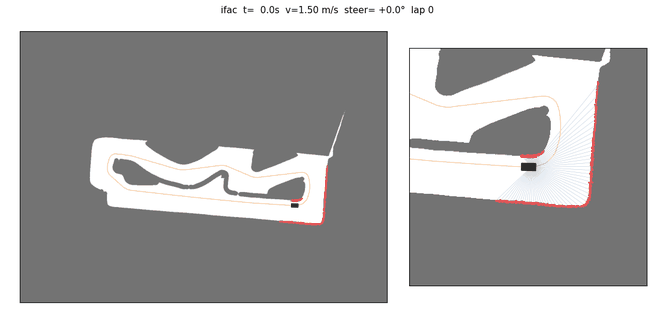
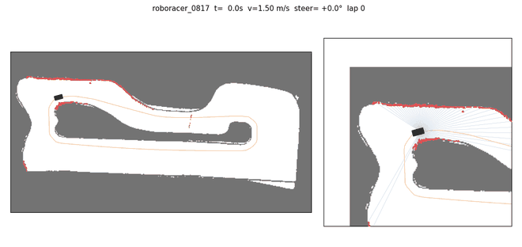
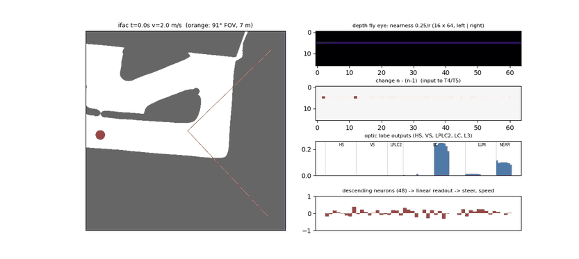
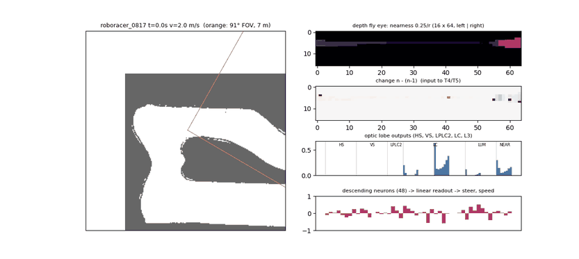
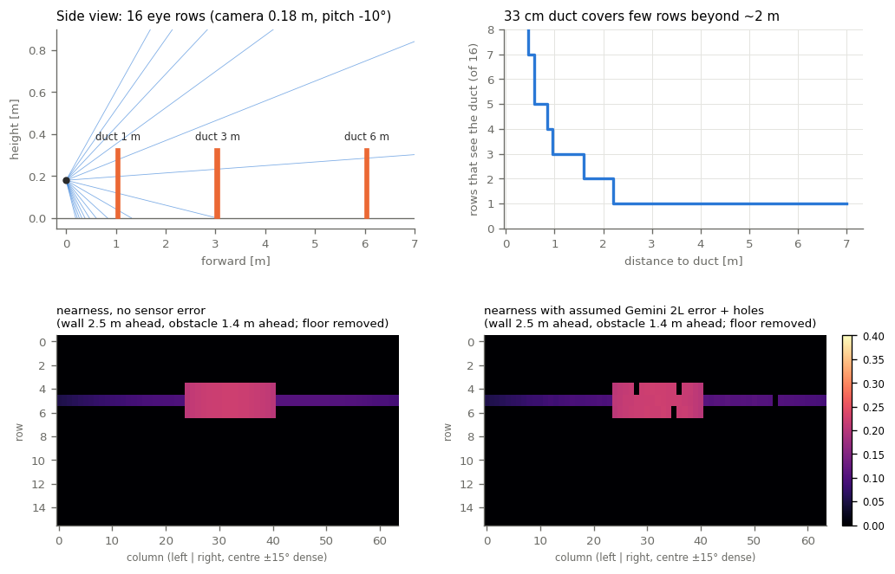
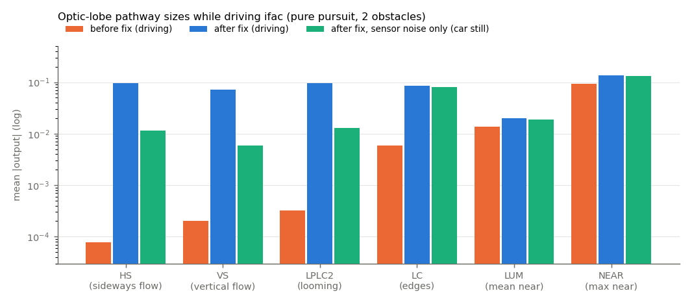

# 맵 없는 강화학습 주행 — 진행 보고서 (2026-10-03)

F1TENTH / Roboracer 2026 · 아주대 · 브랜치 `feat/mapless40-asym-sac`

> **한 줄 요약.** LiDAR 정책(mapless40 v3)은 시뮬에서 팀 맵 3바퀴 무사고 9.63 s까지 학습됐고 실차 시험을 기다린다.
> 다음 목표는 **LiDAR 없이 depth 카메라 한 대 + 초파리 커넥톰 회로만으로** 달리는 것(`camera/depthfly`).
> 구조·시뮬 센서·실차 노드까지 만들었고 numpy 검증은 통과했다. **torch 학습은 아직 안 돌렸고, 시뮬 depth 오차는 실측이 아닌 추정값**이다.

---

## 1. 목표와 조건

| 항목 | 내용 |
|--|--|
| 목표 | 맵·위치추정(SLAM/로컬라이제이션) 없이 센서 → 정책 → `/drive` 를 바로 내는 강화학습 주행 |
| 차량 컴퓨터 | Jetson Orin Nano (6코어). 추론은 torch 없이 numpy |
| 학습 | Colab 무료 T4 (노트북 확보 후 로컬) |
| 속도 | 정책 명령 2~5 m/s, 실차 배터리 한계 6 m/s, 실차 첫 시험은 상한 2.0 m/s |
| 대회 규정 (카메라) | 카메라·스테레오·depth 허용, 카메라 내부 물체 인식·VIO 금지, 계산은 차 안에서. LiDAR 는 선택 |
| 트랙 | 경계 = 높이 33 cm 에어덕트 (사이에 틈이 있을 수 있음), 덕트·장애물 색은 정해지지 않음 |

학습 방식은 세 갈래 모두 같다: **SAC + asymmetric actor-critic**. actor(실차에 올라가는 쪽)는 센서·속도·IMU 만 보고,
critic(학습할 때만)은 레이싱라인 오차·곡률·목표 속도·앞 장애물 위치(privileged 27개)를 추가로 본다.
그래서 실차에는 맵도 레이싱라인도 필요 없다.

## 2. 지금까지의 결과 — LiDAR 정책 (mapless40 v3)

입력: LiDAR 최근 4스캔(1125빔, 10 m) + IMU + 속도, 40 Hz. 인코더: 1D CNN → MLP 256·256. 자세한 기록 [`mapless40/RESULTS.md`](mapless40/RESULTS.md).

| 조건 (v3, 31.8만 스텝) | 결과 | 비교 |
|--|--|--|
| 팀 맵(Cartographer 0817), 장애물 없음 | 출발 4곳 모두 3바퀴 무사고, **9.63~9.65 s** | 레이싱라인 이론 10.0 s, FTG 12.7 s |
| 팀 맵, 장애물 2개 | 4번 중 2번 3바퀴 (최고 9.18 s) | |
| ifac, 장애물 없음 | 4번 중 1번 3바퀴, **최고 10.9 s** | 이론 11.0 s, pure pursuit 11.5 s, FTG 18.0 s |
| ifac, 장애물 2개 | 4번 중 2번 3바퀴 | |

| v3 · ifac | v3 · 팀 맵 |
|--|--|
|  |  |

주의:
- 팀 맵은 방 바닥까지 빈칸으로 찍힌 SLAM 맵이라 실제 트랙보다 넓게 도는 구간이 있다. 9.6 s 를 "실제 트랙 안 기록"으로 읽으면 안 된다.
- 서보·구동 지연, 타력 감속, 코너 한계는 실측 전 추정값이다.
- 이후 v4(횡가속 상한 4.5 m/s² + 벌점)로 이어 학습 중. 실차 실행 방법은 [`realcar/README.md`](realcar/README.md).

## 3. 왜 카메라로 가나, 왜 depth 인가

**카메라 선택: Orbbec Gemini 2L.** depth 를 카메라 칩이 계산해서 Jetson 부담이 거의 없고, ROS2 드라이버가 있고, IR·RGB 모두 글로벌 셔터다.
depth 는 최대 30 fps 라서 제어도 30 Hz 로 정했다 (40 fps 모드 없음).

**RGB 대신 depth 를 쓰는 이유**

| | depth | RGB |
|--|--|--|
| 덕트·장애물 색이 랜덤 | 영향 없음 (거리만 잼) | 색·조명·반사를 전부 랜덤화해서 학습해야 함 |
| "벽이 얼마나 가까운가" | 픽셀 값이 곧 거리 | 정책이 영상에서 배워야 함 → 큰 CNN 이 필요, 작은 커넥톰에 부적합 |
| 시뮬로 흉내 | 레이캐스팅 + 오차 모델 (실측 몇 번으로 맞춤) | 사실적 렌더링 필요 |
| 약점 | **반사(은박)·흡수(검정) 재질에서 구멍**, 먼 거리 오차 | 멀리 보이고 경계가 선명함 |

→ **depth 로 가고, 카메라가 오면 실제 덕트에서 구멍이 얼마나 나는지 먼저 잰다.** 심하면 RGB 를 보조로 검토 (같은 카메라에 RGB 도 있음).

**맵은 LiDAR 맵을 그대로 쓴다.** 맵은 벽이 어디 있는지(기하)이고 LiDAR 가 카메라보다 정확하다. 실제 카메라 데이터로 맞춰야 하는 것은
**센서 모델**(카메라가 그 벽을 어떻게 보는가: 오차·구멍·가짜 점·지연)이다. 카메라로 매핑한 공개 레이싱 맵은 찾지 못했다
(카메라가 달린 3D 시뮬레이터 트랙은 있음: AutoDRIVE F1TENTH, Isaac Sim — 지금 입력 해상도에선 이득이 작다).

## 4. depthfly 구조 — depth 하나 + 초파리 커넥톰만

```
Gemini 2L depth (30 fps, 카메라 칩에서 계산)
  │ 칸마다 주변 픽셀 → 차체 좌표 → 바닥(5 cm 아래) 제거 → 가장 가까운 점
  ▼
파리 눈 '가까움' 영상 16행 × 64열 (정면 ±15° 에 열 절반)   가까움 = 0.25 m / 수평거리, 7 m 밖·구멍 = 0, 구멍은 2프레임 유지
  × 최근 3프레임 (n-2, n-1, n)
  ▼
lamina   ON/OFF = ±Δ가까움, 대비 적응 Δ/(|Δ|+0.01)
T4/T5    Reichardt 움직임 검출 4방향 (왼·오·위·아래)
HS/VS 32 · LPLC2(다가옴) 8 · LC(가장자리) 32 · L3(가까움 평균·최대) 24   = 96
  ▼
하행 뉴런 DN 48  — 고정 희소 배선 (뉴런마다 입력 12개, 흥분/억제 고정), 연결 세기만 학습 → tanh
  ▼ ‖ 상태 14 (속도·요레이트 3구간 평균, 최신 요레이트, 직전 명령 2, Δt 3)
선형 읽기 → 조향 ±21.4°, 속도 2~5 m/s
```

- 실제로 쓰이는 학습 값 약 760개 (CNN·MLP 없음). 연결 구조는 설계로 고정, 세기만 학습 (FLYNN 방식).
- 커넥톰은 **합성**이다 (초파리 시각엽의 알려진 세포 유형·연결 방식을 따랐지만 실제 연결 데이터는 아님).
  실제 연결로 바꾸는 것은 flyvis (Lappalainen et al., Nature 2024) 가 후보.
- Jetson 부하: 칸 샘플링 ~2 ms + 회로 ~0.5 ms (클라우드 CPU 측정) → 30 Hz 예산 33 ms 의 10~20 %, CPU 1코어.

| 학습 전 회로 · ifac + 장애물 2개 | 학습 전 회로 · 팀 맵 |
|--|--|
|  |  |

*pure pursuit 가 운전하고 회로는 초기값 (학습 전). 왼쪽: 트랙·91° 시야(7 m)·장애물(빨강). 오른쪽 위→아래: 가까움 영상, 프레임 변화(T4/T5 입력),
시각엽 출력 96, DN 48. 팀 맵은 방 벽이 멀어서 가까움 값이 작게 보인다.*

## 5. 시뮬 depth 센서 — 무엇이 실측이 아닌가



| 부분 | 지금 시뮬 | 출처 |
|--|--|--|
| 트랙 | LiDAR 2D 맵의 벽을 **높이 33 cm 덕트**로 세움 | 맵 실측, 높이 규정 |
| 카메라 | 91°×66°, 높이 0.18 m, 아래로 10°, 차 앞 0.139 m | 사양 + **가정한 장착** |
| depth 오차 | σ = 0.005·d² (4 m 에서 8 cm) | **추정** |
| depth 구멍 | 2 % + 15 %·(d/7)², 칸마다 독립 | **추정** |
| 계산·전송 지연 | 30 ms | **추정** |
| 아직 없음 | 덕트 사이 틈, 가장자리 가짜 점, 반사 재질의 큰 구멍, 진동 | — |

**알려진 약점:** 덕트가 33 cm 라 2 m 밖에서는 16행 중 1~2행에만 걸린다 (위 오른쪽 그래프). 열을 정면에 몰았듯 행도 지평선 근처로 몰아야 한다.

## 6. 이번에 찾아서 고친 문제 — 움직임 신호가 너무 작았다

주행 중 시각엽 출력 크기를 경로별로 재보니 **움직임 경로(HS·VS·LPLC2)가 가까움(NEAR)보다 약 300~1200배 작았다.**
주행 중 프레임 간 가까움 변화가 평균 0.003 이고, Reichardt 검출은 이런 작은 값 두 개를 곱하며, 덕트가 1~2행뿐이라 평균을 내면 더 묽어지기 때문.
이 상태로는 과거 3프레임을 넣어도 정책이 움직임을 거의 쓸 수 없다.

수정 (`camera/depthfly/brain.py`):
1. **lamina 대비 적응** Δ → Δ/(|Δ|+0.01) — 작은 변화도 일정한 크기로 (파리 시각계의 대비 적응과 비슷한 역할).
2. **경로별 고정 이득** HS·VS 50, LPLC2 20, LC 10, L3 1 (회로 설계값). 학습되는 이득은 그 위에서 1 로 시작.



| 경로 | 수정 전 (주행) | 수정 후 (주행) | 수정 후, 잡음만 (정지) |
|--|--|--|--|
| HS (옆 흐름) | 7.7e-5 | 9.7e-2 | 1.2e-2 |
| VS (위아래 흐름) | 2.1e-4 | 7.2e-2 | 5.9e-3 |
| LPLC2 (다가옴) | 3.3e-4 | 9.7e-2 | 1.3e-2 |
| LC (가장자리) | 5.8e-3 | 8.4e-2 | 8.1e-2 |
| LUM (평균 가까움) | 1.4e-2 | 2.0e-2 | 1.9e-2 |
| NEAR (최대 가까움) | 9.3e-2 | 1.35e-1 | 1.32e-1 |

이제 모든 경로가 0.02~0.13 으로 비슷하고, 움직임 경로는 잡음만 있을 때보다 주행 중에 **약 8~12배** 크다 (잡음에 반응하는 게 아니라 실제 움직임에 반응).
LC·LUM·NEAR 는 정지해도 값이 있는 게 정상 (장면 자체를 보는 경로). 재현: `python -m camera.depthfly.report_figs --out docs/report`.

## 7. 검증 현황

| 항목 | 상태 |
|--|--|
| 시뮬 센서 기하 (3 m 벽 → 덕트 높이 행만, 바닥 제거) | ✅ 통과 |
| 구멍 2프레임 유지 | ✅ 통과 |
| 실차 변환: 합성 Gemini depth 영상 → 4 m 벽 가까움 (오차 8 % 이내) | ✅ 통과 |
| 회로 선택성: 왼/오 움직임 부호, 다가올 때만 LPLC2, 정지 장면 움직임 0 | ✅ 통과 |
| 회로 속도 0.45 ms/프레임, 카메라 환경에서 pure pursuit ifac 완주 14.1 s | ✅ 통과 |
| 회로 torch == numpy, SAC 학습 루프, numpy actor == torch actor | ⬜ **아직 안 돌림** (이 작업 환경에 torch 없음) |
| 학습 / 평가 | ⬜ 아직 |
| 실제 카메라 데이터 | ⬜ 카메라 도착 전 |

## 8. 30 fps 로 7 m/s 를 달려도 되나 (계산, 시뮬 실험 아님)

현재 정책 속도 범위는 2~5 m/s, 실차 배터리 한계 6 m/s 다. 7 m/s 는 지금 범위 밖이지만 나중을 위해 따져본다.

| 속도 | 프레임당 이동 | 옆 벽(45° 방향, 횡 0.5 m) 이 프레임당 움직이는 칸 | 정면 10°·3 m 물체 | 반응 전 이동 (130~160 ms 가정) | 타력만으로 속도 40 % 줄이는 거리 |
|--|--|--|--|--|--|
| 2 m/s | 7 cm | 2.0 칸 | 0.24 칸 | 0.26~0.32 m | 1.5 m |
| 5 m/s | 17 cm | 5.0 칸 | 0.61 칸 | 0.65~0.80 m | 6.6 m |
| 7 m/s | 23 cm | 7.0 칸 | 0.85 칸 | 0.91~1.12 m | **10.8 m** |

*반응 시간 = 프레임 대기(평균 17 ms) + 카메라 내부 처리·전송(30~60 ms, **측정 필요**) + 계산 3 ms + 서보(지연 15 ms + 시정수 50 ms, 시뮬 추정).
타력 감속 = 0.6 + 0.15·v m/s² (시뮬 추정, 능동 브레이크 없음). 열 간격은 정면 0.91°, 가장자리 1.91°.*

**결론: 30 fps 자체는 큰 문제가 아니다.** LiDAR 40 Hz 와 비교하면 프레임 대기가 평균 4 ms 늘 뿐이고(7 m/s 에서 3 cm),
반응 시간의 대부분은 카메라 처리 지연과 서보다. 7 m/s 에서 진짜 문제는 세 가지다.

1. **브레이크.** 브레이크 없이 타력만으로는 7 → 4.2 m/s 감속에 약 11 m 가 필요한데, depth 는 7 m 까지만 본다(LiDAR 도 10 m).
   코너를 보고 나서는 늦는다. **고속에서는 능동 브레이크(VESC 역토크)가 필요**하고, 시뮬에는 `brake_enabled` 옵션이 이미 있다.
2. **움직임 검출의 한계.** T4/T5 는 이웃한 한 칸 사이의 움직임만 잰다. 옆 벽은 2 m/s 에서도 프레임당 2칸, 7 m/s 에서 7칸을 건너뛰어
   방향을 잘못 읽을 수 있다(정면 물체는 1칸 미만이라 괜찮음). → 2·4·8칸 간격의 검출기를 추가하거나, 옆은 가까움(NEAR·LC)으로 판단하게 둔다.
3. **먼 거리 depth 품질.** 7 m 에서 오차 σ 약 25 cm(추정)이고 덕트가 1행에만 걸린다. 고속일수록 먼 곳 정보가 중요한데 그게 가장 약하다.

→ 고속 전에 할 일: 카메라 지연 실측, 실차 브레이크 가능 여부 확인, 움직임 검출기 다중 간격화, 행 배치 개선. 7 m/s 는 이것들이 된 뒤 시뮬에서 속도 범위를 넓혀 확인.

## 9. 다음 단계

**카메라 오기 전 (시뮬)**
1. `python -m camera.depthfly.tests` → 8/8 (torch 2개 포함). 실패하면 여기부터.
2. 짧은 학습 6만 스텝 → steps/s, 진행률·보상이 오르는지.
3. 본 학습 (코랩 `camera/depthfly/colab_train.ipynb` 또는 로컬) → ifac·팀 맵, 장애물 0·2개 평가. 비교: LiDAR v3.
4. 센서 스트레스 평가 (구현 필요): 노이즈 ×2·×3, 구멍 ×2, 섹터 통째 구멍(반사 덕트 가정), pitch ±3°, 높이 ±2 cm, 지연 +30 ms.
5. 행을 지평선 근처로 몰기, 움직임 검출기 다중 간격(2·4·8칸) → 재학습 비교. 덕트 틈·가장자리 가짜 점 추가.
6. 고속 대비: 시뮬 능동 브레이크 켜고 속도 범위 확장 실험.

**카메라 도착 후**
1. 정지 측정: 실제 덕트를 1·2·3·5·7 m 에 두고 거리별 오차·구멍 비율.
2. 카메라 + LiDAR 같이 달고 수동 주행 rosbag → LiDAR 를 정답으로 칸별 오차·구멍 지도 (비교 스크립트 구현 필요).
3. 시뮬 센서 모델 보정 → 실제 vs 시뮬 가까움 영상 나란히 비교 → 재학습 → 실차 `max_speed:=2.0`.

## 10. 파일 위치

| 위치 | 내용 |
|--|--|
| [`CLAUDE.md`](CLAUDE.md) | 작업 인수인계 (Claude Code 가 자동으로 읽음) |
| [`camera/`](camera/README.md) | 카메라 작업 전부. `depthfly/` = 주력, `camfly/` = 첫 버전(RGB+depth, depthfly 가 부품을 가져다 씀) |
| [`camera/depthfly/README.md`](camera/depthfly/README.md) | depthfly 상세 (파일별 설명, 실행, 검증 계획) |
| [`mapless40/`](mapless40/RESULTS.md) | LiDAR 정책 + 공통 차량 시뮬·SAC |
| `maps/`, `f1tenth_racetracks/` | 트랙 (LiDAR SLAM 맵 · 서킷 축소 맵) |
| `docs/report/` | 이 보고서 그림 |
