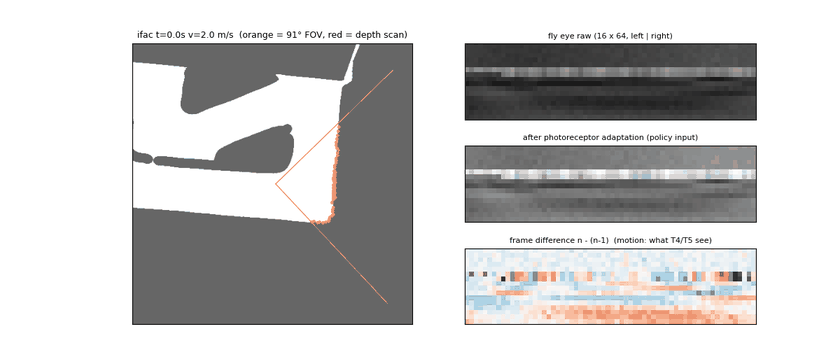

# camfly — 카메라 한 대 + 초파리 커넥톰 강화학습

LiDAR 없이 **Orbbec Gemini 2L** 한 대로 달린다. 정책은 CNN·MLP 대신 **초파리 시각엽 회로(합성 커넥톰)** 를 지나
하행 뉴런(DN) 활동을 **선형으로 읽어** 조향·속도를 낸다. 차량 동역학·보상·레이싱라인(critic 전용)·장애물·평가·저장은
[`mapless40`](../../mapless40/RESULTS.md) 를 그대로 쓴다.



*시뮬 카메라 (pure pursuit 로 주행). 왼쪽: 트랙과 91° 시야(주황), depth 가짜 스캔(빨강). 오른쪽 위→아래:
파리 눈 원본 16×64, 광수용체 적응 후(정책 입력), 연속 프레임 차이(T4/T5 가 보는 움직임).*

## 1. 구조

```
Gemini 2L ─┬─ RGB(글로벌 셔터) → 흑백 → 파리 눈 재샘플링 16×64 (정면 ±15° 촘촘) → 밝기 적응 ─┐ 최근 3프레임
           └─ depth (RGB 정렬) → 열마다 바닥보다 높은 최근접 거리 (≤ 7 m) ─────────────────┘ (n-2, n-1, n)
                                    │
         ┌──────────────── 합성 커넥톰 (camfly/flybrain.py) ────────────────┐
         │ lamina   L_ON/L_OFF = ±Δ밝기 (빠른 갈래: n−(n−1), 느린 갈래: (n−1)−(n−2)) │
         │ T4/T5    Reichardt 상관기, 4방향 (왼·오·위·아래), 방향별 이득 학습         │
         │ HS/VS    섹터 8 × 밴드 2 의 수평·수직 흐름 (통로 가운데 유지)               │
         │ LPLC2    섹터별 바깥쪽 흐름 = 다가옴 (충돌 직전)                           │
         │ LC       섹터·밴드별 가장자리 (벽·장애물 위치)                             │
         │ depth    섹터별 최근접 거리 + 다가오는 속도                                │
         │ DN 48    고정 희소 배선(입력 12개, 부호 고정) × 학습되는 세기 (FLYNN 방식)  │
         └─────────────────────────────────────────────────────────────────┘
                                    │ DN 48 ‖ 상태 14 (v̄×3, ω̄×3, ω, 직전 명령 2개, Δt×3)
                                    ▼
                  선형 읽기 → tanh → (조향 ±21.4°, 속도 2~5 m/s)        30 Hz
critic (학습 전용): 같은 구조 + 레이싱라인·장애물 privileged 27 → MLP 256·256
```

학습되는 actor 값은 실제로 쓰이는 것 기준 **약 900개** (T4/T5·LPTC 이득 12, DN 연결 세기 48×12 = 576, DN 바이어스 48, 선형 읽기층 ≈ 250). 연결 구조(어느 뉴런이 어디로, 흥분/억제)는 고정.
비교 기준 `--encoder cnn --pi-net 256,256` (같은 입력의 작은 CNN).

## 2. 파일

| 파일 | 내용 |
|--|--|
| `config.py` | `CameraSpec` (Gemini 2L: 91°×66°, 높이 0.18 m, 10° 숙임, depth σ = 0.005·d², 구멍), `SceneSpec` (덕트 33 cm, 밝기·질감 랜덤화), 30 Hz |
| `eye.py` | 시뮬 렌더러 `FlyEyeRenderer` (2D 맵 레이캐스팅 → 행마다 장애물/덕트/바닥/배경), depth 가짜 스캔, **실차용** `eye_pixel_map`·`resample_gray`·`depth_to_scan` (같은 격자) |
| `env.py` | `CamFlyEnv` = mapless40 환경 + 카메라 관측 (eye, dscan, state, priv) |
| `flybrain.py` | 커넥톰 회로 numpy 참조 + torch `FlyBrain` (같은 수식), 비교용 `SmallCNN` |
| `policy.py` | SB3 특징 추출기 `CamFeatures`, 배포용 `CamDeterministicActor` |
| `np_actor.py` | 학습 zip → numpy actor (torch 없이, 0.5 ms/프레임) |
| `train.py` / `evaluate.py` / `viz.py` | 학습 · 평가 · 파리 눈 GIF |
| `ros_node.py` | Jetson ROS2 노드: Gemini 2L color·depth·camera_info + IMU·속도 → `/drive` |
| `tests.py` | 렌더러 기하, 실차 픽셀 매핑, depth 스캔, 방향 선택성, PP 완주 (numpy) + torch==numpy, SAC 루프, numpy actor==torch |
| `colab_train.ipynb` | 코랩: 테스트 → 시뮬 카메라 GIF → 학습 → 평가 → 학습된 정책 GIF |

## 3. 사용

```bash
python -m camera.camfly.tests                     # numpy 5개 (+ torch 2개)
python -m camera.camfly.viz --map ifac --out eye.gif
python -m camera.camfly.train --encoder fly --n-envs 4 --subproc --save-dir runs/camfly_fly --resume auto
python -m camera.camfly.evaluate --model runs/camfly_fly/best_model.zip --maps ifac,roboracer_0817 --obstacles 2
```

실차 (Jetson):
```bash
ros2 launch orbbec_camera gemini2L.launch.py depth_registration:=true    # OrbbecSDK_ROS2, 토픽 이름 확인
python3 -m camera.camfly.ros_node --ros-args -p model:=best_model.zip -p max_speed:=2.0 -p cam_pitch_deg:=-10.0
```
- 노출 **고정·짧게(≤ 2 ms)**, 자동 화이트밸런스 끄기. 시뮬은 밝기를 랜덤화해 학습했다.
- `cam_pitch_deg` 는 실제 장착 각도로. 카메라 높이를 바꾸면 `CameraSpec.height` 도 맞추고 재학습.

## 4. 검증된 것 / 아직 아닌 것

- 이 환경(numpy): 렌더러 기하(벽 행 위치), depth 스캔, 합성 depth 영상 → 스캔 (4 m 벽 ±15 cm), 핀홀 픽셀 매핑,
  커넥톰 방향 선택성(왼/오, 위/아래 부호, 다가옴만 LPLC2), 카메라 환경에서 pure pursuit ifac 완주, numpy actor (가짜 zip).
- **torch 부분은 코랩 ④ 에서 처음 실행된다** (FlyBrain == numpy, SAC 학습 루프, numpy actor == torch actor).
- 학습 결과는 아직 없음.

## 5. 다음

1. 코랩에서 `fly` 와 `cnn` 학습 → 같은 평가로 비교 (랩·충돌·장애물, 센서 가림 강건성).
2. 시뮬 보강: 규정의 **덕트 사이 틈**, 실측 카메라 지연(노출+USB+처리), 바닥 반사.
3. 카메라 도착 → 트랙에서 rosbag (`/camera/*`, `/imu/data`, `/vehicle/speed_mps`) → 실제 파리 눈 영상과 시뮬 비교 (차 안 굴리고).
4. 합성 커넥톰 → **flyvis** (Lappalainen et al. Nature 2024, 실제 시각엽 연결·공개 학습 모델) 로 교체: 파리 눈 격자 → 육각 격자 변환.
