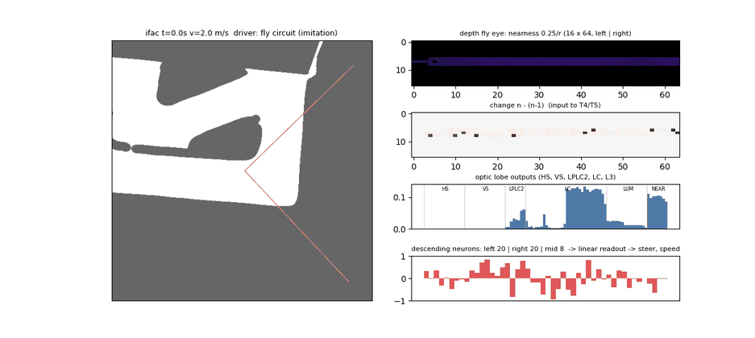
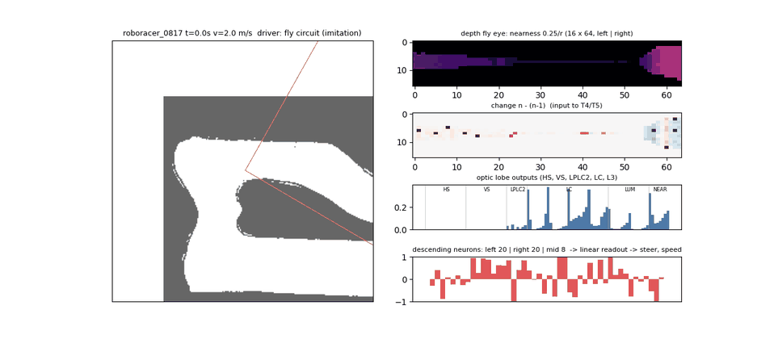

# depthfly — depth 카메라 하나 + 초파리 커넥톰만

**Orbbec Gemini 2L 의 depth 영상만** 쓴다. RGB·LiDAR·CNN·MLP·별도 depth 경로 없음.
depth 를 파리 눈 격자(16×64)의 **가까움 영상**으로 바꿔 광수용체 자리에 넣고, 합성 커넥톰 시각엽을 지난
하행 뉴런(DN) 48개를 **선형으로 읽어** 조향·속도를 낸다. 과거 3프레임, 30 Hz.
차량 동역학·보상·레이싱라인(critic 전용)·장애물·평가는 [`mapless40`](../../mapless40/RESULTS.md), 카메라 기하·회로 부품은 [`camfly`](../camfly/README.md) 를 쓴다.


*학습 전 (pure pursuit 주행, 초기 회로). 왼쪽: 트랙·91° 시야·장애물(빨강). 오른쪽 위→아래: 가까움 영상 16×64 (바닥 제거, 덕트만),
프레임 변화 n−(n−1) (T4/T5 입력), 시각엽 출력 96, DN 48.*

## v3 — 회로 극성 검사·수정 + 레이싱라인 모방학습으로 시작

v2 를 처음부터 SAC 로 학습했더니 10만 스텝에도 평가에서 ifac 0.2바퀴·팀 맵 0.3바퀴에서 매번 충돌. 원인을 찾으며 고친 것:

**1. 극성 전수 검사** (`python -m camera.depthfly.polarity`, 시뮬 장면 11개 → 지금 11/11 OK)

| 단계 | 검사 | v2 | v3 |
|--|--|--|--|
| HS | 왼쪽으로 회전 → 영상이 오른쪽으로 흐름 → HS − (오른쪽 회전은 +) | OK | OK |
| HS | 매끈한 벽을 따라 직진 → HS ≈ 0 | — | OK (depth 엔 무늬가 없어 흐름이 안 생기는 게 정상. 벽 거리는 NEAR 가 담당) |
| HS | 벽에 기둥·틈이 있으면 왼쪽 시야 +, 오른쪽 시야 − (바깥쪽 흐름) | — | OK |
| NEAR | 가까운 쪽 섹터가 큼 | OK | OK |
| **LPLC2** | 정면 장애물로 다가감 → + , 멀어짐 → 작음 | **틀림** (2 m 밖 물체는 가장자리가 프레임당 1칸도 안 움직여 '안쪽 흐름' 으로 읽힘) | OK — 다가옴 = 가까움 증가율 Δn/n (고정 크기 물체의 시각 크기 팽창률과 같은 양), 잡음 문턱 0.005 |
| **DN 부호** | 왼쪽이 가까우면 왼쪽 DN 흥분·오른쪽 억제, 좌우 뒤집은 영상 → 짝 DN 이 똑같이 | **랜덤 60:40** (의미 없음) | OK — 좌우 20쌍 거울상 + 가운데 8개, 같은 쪽 흥분·반대쪽 억제 (`make_dn_wiring_bilateral`) |
| LC | 좌우 대칭 | 한 칸 어긋남 | 대칭 가장자리 |

실제 초파리 연결 데이터는 아니고 원칙(좌우 대칭, 같은 쪽 흥분/반대쪽 억제, HS 의 회전·바깥쪽 흐름 선호, LPLC2 = 팽창 감지)을 따른 배선이다.

**2. 레이싱라인 모방학습 (DAgger, `bc.py`, torch 없이 numpy)**
- 선생님 = 레이싱라인 pure pursuit. 반복 0 은 선생님이 (작은 조향 잡음과 함께) 운전, 이후 학생이 운전하고 매 순간 선생님 정답을 기록 (β 0.5 → 0).
- 학습하는 것: DN 세기·바이어스 + 읽기층 (시각엽 이득 고정). **'직전 명령' 입력은 모방학습 동안 0 으로 고정** — 보게 하면
  '방금 한 걸 반복' 만 배워서 검증 손실은 낮은데 혼자 몰면 충돌함 (copycat 문제, 실제로 확인).
- 결과 (`results/bc_init_v3.npz`, 21만 샘플, 14반복 중 10번째): 출발 4곳 × 2맵, 3바퀴 → **5/8 완주, 모두 1바퀴 이상**.
  최고랩 ifac 12.8 s · 팀 맵 11.5 s (선생님 pure pursuit 14.1 s · 12.6 s 보다 빠름 — 학생은 선생님 속도의 0.9 배 제한이 없음). 장애물 2개: 1/8 (선생님이 장애물을 안 피하므로 SAC 몫).

| 회로가 직접 운전 (모방학습) · ifac | 팀 맵 |
|--|--|
|  |  |

**3. SAC 로 넘기기 (`train.py --bc-init`)** — 회로(actor·critic·target 모두)와 읽기층을 npz 에서 불러오고, 행동 잡음 σ≈0.1, 엔트로피 계수 0.02·목표 엔트로피 −3.5 로 시작
(기본 auto 는 계수 1.0·목표 −1 이라 모방한 정책을 바로 무작위로 흐트러뜨림. 첫 코랩 실행에서 σ 0.2·목표 −1 로 했더니 학습 중 에피소드가 매번 8초 안에 충돌하고
엔트로피 계수가 0.025 → 0.5 로 계속 커짐 → v3b 에서 수정. 시뮬 확인: 같은 정책이 σ 0.2 면 226 스텝, σ 0.1 이면 510 스텝(잡음 없을 때 481)). 버퍼는 모방한 정책으로 채우고, 이어 3만 스텝은 **critic 만** 학습 (actor 고정).
이 부분은 torch 라 이 작업 환경에선 못 돌렸다 → `tests.py` 의 `test_bc_handoff_torch` (npz → SAC → zip → numpy actor 가 학생과 같은 행동, 고정 구간에 actor 불변) 를 코랩 ④ 에서 확인.

## 1. 구조

```
Gemini 2L depth (칩에서 계산, 30 fps)
   │  칸마다 주변 픽셀 → 차체 좌표 → 높이 판정 (5 cm + d·tan1.5° ~ 0.40 m + d·tan1.5° 만 남김) → 중앙값
   ▼
가까움 영상 16×64  (행 12개는 지평선 ±8°, 0.25 m / 수평거리, 7 m 밖·구멍 = 0, 구멍은 2프레임까지 직전 값 유지)  × 최근 3프레임 (n-2, n-1, n)
   │
   ├ lamina  ON/OFF = ±Δ가까움 (빠른 n−(n−1), 느린 (n−1)−(n−2)), 대비 적응 Δ/(|Δ|+0.01)
   ├ T4/T5   Reichardt 상관기 4방향, 방향별 이득 학습
   ├ HS/VS   섹터 8 × 밴드 2 수평·수직 흐름            16 + 16     (경로별 고정 이득 HS·VS 15, LPLC2 7, LC 10, L3 1)
   ├ LPLC2   섹터별 바깥쪽 흐름 = 다가옴                 8
   ├ LC      섹터·밴드별 가장자리 (덕트·장애물 경계)     32
   └ L3      섹터·밴드별 평균 가까움 + 섹터별 최대       16 + 8      = 96
   ▼
DN 48   고정 희소 배선 (입력 12개, 부호 고정) × 학습되는 세기 → tanh
   ▼  ‖ 상태 14 (v̄×3, ω̄×3, ω, 직전 명령 2, Δt×3)
선형 읽기 → (조향 ±21.4°, 속도 2~8 m/s)
critic (학습 전용): 같은 회로 + 레이싱라인·장애물 privileged 27 → MLP 256·256
```

실제로 쓰이는 학습 값 ≈ 760개 (이득 13, DN 세기 48×12 = 576, DN 바이어스 48, 선형 읽기 62×2+2). 배선(누가 누구에게, 흥분/억제)은 고정.

**왜 30 Hz:** Gemini 2L depth 는 Unbinned 모드(최적 0.30~7.0 m)에서 최대 30 fps. Binned Sparse 모드는 640×400 에서 60 fps 가 되지만 최적 범위가 0.25~5.0 m (데이터시트 v1.0). 과거 3프레임 = 0.1 s 의 움직임.
**Jetson 부하:** depth 는 카메라가 계산. Jetson 은 칸 샘플링 ~2 ms + 회로 ~0.5 ms (노트북 CPU 측정, Orin Nano 는 2~3배 예상) → 33 ms 예산의 10~20 %, CPU 1코어. GPU·torch 불필요.

## 2. 파일

| 파일 | 내용 |
|--|--|
| `config.py` | `DepthFlyConfig(fps=30, hist=3)` (camfly 설정 재사용: 91°×66°, 높이 0.18 m, 10° 숙임, depth 0.25~7 m, σ = 0.01·d², 구멍) |
| `sensor.py` | `DepthEyeSim` (시뮬: 레이캐스팅 → 덕트·장애물만, 잡음·구멍), `DepthEyeReal` (실차 depth 영상 → 같은 격자), `HoleHold` |
| `brain.py` | 커넥톰 회로 numpy 참조 + torch `DepthFlyBrain` (같은 수식) |
| `env.py` | `DepthFlyEnv` = mapless40 환경 + 관측 near(3,16,64)·state·priv |
| `policy.py` / `np_actor.py` | SB3 특징 추출기, 배포용 actor / 학습 zip → numpy actor (torch 없이) |
| `train.py` / `evaluate.py` / `viz.py` | 학습 · 평가 · 회로 활동 GIF |
| `ros_node.py` | Jetson ROS2: depth + camera_info + IMU + 속도 → `/drive`, depth 프레임마다 1회 |
| `polarity.py` | 회로 단계별 극성 검사 (시뮬 장면 11개) |
| `bc.py` / `bc_eval.py` | 레이싱라인 모방학습 (DAgger, numpy) / 결과 평가 (출발 여러 곳 × 여러 바퀴) |
| `tests.py` | numpy 9 (센서 기하, pitch 오차 바닥 누출, 구멍 유지, 합성 depth 영상, 선택성, 속도, PP 완주, **극성 11개**, 모방학습 학생) + torch 3 (회로 torch==numpy, SAC 루프·numpy actor, **모방학습 → SAC 넘기기**) |
| `colab_train.ipynb` | 코랩: 테스트·극성 → GIF → 모방학습 → SAC → 평가 → GIF (`mapless40_runs/depthfly_v3`) |

## 3. 사용

```bash
python -m camera.depthfly.tests
python -m camera.depthfly.viz --map ifac --out eye.gif
python -m camera.depthfly.train --n-envs 4 --subproc --save-dir runs/depthfly --resume auto
python -m camera.depthfly.evaluate --model runs/depthfly/best_model.zip --maps ifac,roboracer_0817 --obstacles 2
```

실차 (Jetson):
```bash
ros2 launch orbbec_camera gemini2L.launch.py enable_color:=false depth_fps:=30     # 인자 이름은 드라이버 버전에 맞게
python3 -m camera.depthfly.ros_node --ros-args -p model:=best_model.zip -p max_speed:=2.0 -p cam_pitch_deg:=-10.0
```
- `cam_pitch_deg` 는 실제 장착 각도. 높이(0.18 m)를 바꾸면 `CameraSpec.height` 맞추고 재학습.
- 토픽 이름은 `ros2 topic list` 로 확인 후 `-p depth_topic:=... -p info_topic:=...`.

## 4. 검증된 것 / 아직 아닌 것

- **속도 2~8 m/s** (`config.V_MAX`, `--v-max`; mapless40 은 2~5). 능동 브레이크는 `--brake` (기본 꺼짐 = 타력 감속만).
  학습·평가·시각화에 같은 값을 줘야 한다. pure pursuit 1랩 실측 (레이싱라인 속도 계획, 횡가속 3.6 m/s²):

  | 맵 | 5 m/s 까지 | 8 m/s 까지 | 8 m/s + 브레이크 |
  |--|--|--|--|
  | ifac | 14.1 s, 최고 4.5 | 14.1 s, 최고 4.6 | 13.2 s, 최고 5.4 |
  | roboracer_0817 | 12.6 s, 최고 4.3 | 12.6 s, 최고 4.4 | 11.4 s, 최고 5.1 |
  | Spielberg (60 s 주행) | 평균 4.2, 최고 4.5 | 평균 5.1, 최고 7.2 | 평균 5.2, 최고 7.2 |

  팀 맵·ifac 은 직선이 짧아 한계를 8 로 올려도 5 m/s 안팎까지만 쓴다. 7 m/s 이상은 큰 서킷 맵에서만 나온다.

- 여기서 (numpy): 시뮬 센서 기하 (3 m 벽 → 덕트 높이 행만, 바닥 제거), 합성 Gemini depth 영상 → 4 m 벽 가까움 ±8 %,
  T4/T5 왼/오 부호, LPLC2 다가옴 선택, 정지 장면 → 움직임 0, ifac pure pursuit 완주 (14.1 s, env 3.3 ms/step).
- torch 부분 (회로 torch == numpy, SAC 루프, numpy actor == torch) 포함 9/9 통과 (로컬 CPU, torch 2.14).
- 관측 정의 v2 실측 (pure pursuit 1랩, ifac): 값이 25 % 넘게 있는 행 1~2개 → 4개, 움직임 특징(HS·VS·LPLC2) 평균 크기 0.06~0.08
  (가까움 0.12), 잡음만 있을 때의 약 3배. 평평한 바닥만 있을 때 pitch 오차 ±1.5° 까지 가짜 칸 0 (전에는 −2° 에서 1.7 m 가짜 벽).
- 학습 결과 아직 없음.

## 5. 시뮬 depth 는 무엇이고, 무엇이 실측이 아닌가

| 부분 | 지금 시뮬 | 출처 |
|--|--|--|
| 트랙 기하 | LiDAR SLAM 2D 맵 (`maps/`) · 서킷 축소 맵 (`f1tenth_racetracks/`) 의 벽을 **높이 33 cm 덕트**로 세움 | 맵 = 실측(LiDAR), 높이 = 규정 |
| 장애물 | 원통 r 0.12~0.30 m, 높이 `SceneSpec.obstacle_height` | 가정 |
| 카메라 | 91°×66°, 높이 0.18 m, 아래로 10°, 차 앞 0.139 m | 사양 + **가정 장착** |
| depth 오차 | σ = 0.01·d² (2 m 에서 4 cm = 2 %, 4 m 에서 16 cm) | 데이터시트 상한 (≤ 2 % @ 2 m), d² 모양은 스테레오 일반식 |
| 최소 거리 | 0.25 m 안쪽 = 측정 없음 | 데이터시트 |
| depth 구멍 | 확률 2 % + 15 %·(d/7)² , 칸마다 독립 | **추정** |
| 장착 pitch 오차 | 에피소드마다 ±1°, 프레임마다 σ 0.3° (광선은 실제 pitch, 해석은 가정 pitch) | **추정** |
| 지연 | 계산 30 ms | **추정** |
| 없음 | 덕트 사이 틈, 가장자리 가짜 점, 반사 재질(은박·검정)로 인한 큰 구멍, 햇빛, 진동 | — |

**맵은 LiDAR 맵이 맞다.** 맵은 벽이 어디 있는지(기하)이고 LiDAR 가 카메라보다 정확하다. 실제 카메라 데이터로 맞춰야 하는 건
**센서 모델**(위 표의 추정 칸)이다. 카메라로 매핑한 공개 레이싱 맵은 찾지 못했다. 카메라가 달린 3D 시뮬레이터
(AutoDRIVE F1TENTH, Isaac Sim) 는 있지만 입력이 16×64 가까움 영상이라 지금은 이득이 작다 (RGB 를 쓸 때 다시 검토).

## 6. 카메라 오기 전 시뮬 검증 계획

| # | 할 일 | 명령 / 방법 | 통과 기준 |
|--|--|--|--|
| 1 | torch 테스트 (완료) | `python -m camera.depthfly.tests` | 9/9 |
| 2 | 시각화 확인 | `python -m camera.depthfly.viz --map roboracer_0817 --obstacles 2 --out x.gif` | 덕트 띠·장애물이 보이고, 바닥·구멍 깜빡임 없음 |
| 3 | 짧은 학습 | `python -m camera.depthfly.train --timesteps 60000 --learning-starts 5000 --n-envs 4 --save-dir runs/df_smoke` | steps/s 기록, 진행률·보상 상승 |
| 4 | 본 학습 | 코랩 노트북 또는 `--timesteps 1000000 --resume auto` | `best.json` 갱신 |
| 5 | 평가 | `python -m camera.depthfly.evaluate --model …/best_model.zip --maps ifac,roboracer_0817 --obstacles 0` (그리고 `2`) | 비교: PP 14.1 s (ifac), mapless40 v3 10.9 s / 팀 맵 9.63 s |
| 6 | **센서 스트레스 평가 (구현 필요)** | evaluate 에 옵션: 노이즈 ×2·×3, 구멍 ×2, 섹터 통째 구멍, pitch ±3°, 높이 ±2 cm, 지연 +30 ms | 어느 조건에서 무너지는지 표 |
| 7 | 행 배치 개선 (완료, v2) | 12행을 지평선 ±8° 에 (`DepthCameraSpec`) | — |
| 8 | 시뮬 보강 (구현 필요) | 덕트 사이 틈, 가장자리 가짜 점 | 학습이 여전히 되는지 |

## 7. 카메라 도착 후

1. **정지 측정**: 덕트를 1·2·3·5·7 m 에 두고 depth 기록 → 거리별 σ, 구멍 비율. 실제 덕트 재질로.
2. **주행 녹화**: 카메라 + LiDAR 같이 달고 수동으로 몇 바퀴, rosbag (`/camera/depth/*`, `/scan`, `/imu/data`, `/vehicle/speed_mps`).
3. **비교 스크립트 (구현 필요)**: bag → `DepthEyeReal` 가까움 영상 vs 같은 시각 LiDAR 로 만든 가까움 → 칸별 오차·구멍 지도 → `CameraSpec` 값 맞춤.
4. 실제 vs 보정된 시뮬 영상 GIF 나란히 → 재학습 → 실차 `max_speed:=2.0`.
