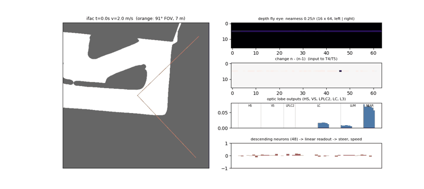

# depthfly — depth 카메라 하나 + 초파리 커넥톰만

**Orbbec Gemini 2L 의 depth 영상만** 쓴다. RGB·LiDAR·CNN·MLP·별도 depth 경로 없음.
depth 를 파리 눈 격자(16×64)의 **가까움 영상**으로 바꿔 광수용체 자리에 넣고, 합성 커넥톰 시각엽을 지난
하행 뉴런(DN) 48개를 **선형으로 읽어** 조향·속도를 낸다. 과거 3프레임, 30 Hz.
차량 동역학·보상·레이싱라인(critic 전용)·장애물·평가는 [`mapless40`](../mapless40/RESULTS.md), 카메라 기하·회로 부품은 [`camfly`](../camfly/README.md) 를 쓴다.



*학습 전 (pure pursuit 주행, 초기 회로). 왼쪽: 트랙·91° 시야·장애물(빨강). 오른쪽 위→아래: 가까움 영상 16×64 (바닥 제거, 덕트만),
프레임 변화 n−(n−1) (T4/T5 입력), 시각엽 출력 96, DN 48.*

## 1. 구조

```
Gemini 2L depth (칩에서 계산, 30 fps)
   │  칸마다 주변 픽셀 → 차체 좌표 → 바닥(5 cm 아래) 제거 → 가장 가까운 점
   ▼
가까움 영상 16×64  (0.25 m / 수평거리, 7 m 밖·구멍 = 0, 구멍은 2프레임까지 직전 값 유지)  × 최근 3프레임 (n-2, n-1, n)
   │
   ├ lamina  ON/OFF = ±Δ가까움 (빠른 n−(n−1), 느린 (n−1)−(n−2))
   ├ T4/T5   Reichardt 상관기 4방향, 방향별 이득 학습
   ├ HS/VS   섹터 8 × 밴드 2 수평·수직 흐름            16 + 16
   ├ LPLC2   섹터별 바깥쪽 흐름 = 다가옴                 8
   ├ LC      섹터·밴드별 가장자리 (덕트·장애물 경계)     32
   └ L3      섹터·밴드별 평균 가까움 + 섹터별 최대       16 + 8      = 96
   ▼
DN 48   고정 희소 배선 (입력 12개, 부호 고정) × 학습되는 세기 → tanh
   ▼  ‖ 상태 14 (v̄×3, ω̄×3, ω, 직전 명령 2, Δt×3)
선형 읽기 → (조향 ±21.4°, 속도 2~5 m/s)
critic (학습 전용): 같은 회로 + 레이싱라인·장애물 privileged 27 → MLP 256·256
```

실제로 쓰이는 학습 값 ≈ 760개 (이득 13, DN 세기 48×12 = 576, DN 바이어스 48, 선형 읽기 62×2+2). 배선(누가 누구에게, 흥분/억제)은 고정.

**왜 30 Hz:** Gemini 2L depth 최대가 30 fps (40 fps 모드 없음). 과거 3프레임 = 0.1 s 의 움직임.
**Jetson 부하:** depth 는 카메라가 계산. Jetson 은 칸 샘플링 ~2 ms + 회로 ~0.5 ms (노트북 CPU 측정, Orin Nano 는 2~3배 예상) → 33 ms 예산의 10~20 %, CPU 1코어. GPU·torch 불필요.

## 2. 파일

| 파일 | 내용 |
|--|--|
| `config.py` | `DepthFlyConfig(fps=30, hist=3)` (camfly 설정 재사용: 91°×66°, 높이 0.18 m, 10° 숙임, depth 7 m, σ = 0.005·d², 구멍) |
| `sensor.py` | `DepthEyeSim` (시뮬: 레이캐스팅 → 덕트·장애물만, 잡음·구멍), `DepthEyeReal` (실차 depth 영상 → 같은 격자), `HoleHold` |
| `brain.py` | 커넥톰 회로 numpy 참조 + torch `DepthFlyBrain` (같은 수식) |
| `env.py` | `DepthFlyEnv` = mapless40 환경 + 관측 near(3,16,64)·state·priv |
| `policy.py` / `np_actor.py` | SB3 특징 추출기, 배포용 actor / 학습 zip → numpy actor (torch 없이) |
| `train.py` / `evaluate.py` / `viz.py` | 학습 · 평가 · 회로 활동 GIF |
| `ros_node.py` | Jetson ROS2: depth + camera_info + IMU + 속도 → `/drive`, depth 프레임마다 1회 |
| `tests.py` | numpy 6 (시뮬 센서 기하, 구멍 유지, 합성 depth 영상 → 가까움, 방향·다가옴 선택성, 속도, PP 완주) + torch 2 |
| `colab_train.ipynb` | 코랩: 테스트 → GIF → 학습 → 평가 → 학습된 정책 GIF (`mapless40_runs/depthfly`) |

## 3. 사용

```bash
python -m depthfly.tests
python -m depthfly.viz --map ifac --out eye.gif
python -m depthfly.train --n-envs 4 --subproc --save-dir runs/depthfly --resume auto
python -m depthfly.evaluate --model runs/depthfly/best_model.zip --maps ifac,roboracer_0817 --obstacles 2
```

실차 (Jetson):
```bash
ros2 launch orbbec_camera gemini2L.launch.py enable_color:=false depth_fps:=30     # 인자 이름은 드라이버 버전에 맞게
python3 -m depthfly.ros_node --ros-args -p model:=best_model.zip -p max_speed:=2.0 -p cam_pitch_deg:=-10.0
```
- `cam_pitch_deg` 는 실제 장착 각도. 높이(0.18 m)를 바꾸면 `CameraSpec.height` 맞추고 재학습.
- 토픽 이름은 `ros2 topic list` 로 확인 후 `-p depth_topic:=... -p info_topic:=...`.

## 4. 검증된 것 / 아직 아닌 것

- 여기서 (numpy): 시뮬 센서 기하 (3 m 벽 → 덕트 높이 행만, 바닥 제거), 합성 Gemini depth 영상 → 4 m 벽 가까움 ±8 %,
  T4/T5 왼/오 부호, LPLC2 다가옴 선택, 정지 장면 → 움직임 0, ifac pure pursuit 완주 (14.1 s, env 3.3 ms/step).
- **torch 부분 (회로 torch == numpy, SAC 루프, numpy actor == torch) 은 코랩 ④ 에서 처음 돈다.**
- 학습 결과 아직 없음.

## 5. 알아둘 점 / 다음

1. 덕트가 33 cm 라 3 m 밖에서는 16행 중 1~2행에만 보인다 (GIF 위 패널의 얇은 띠). 열은 정면 ±15° 를 촘촘히 했듯,
   **행도 지평선 근처로 몰아주는 것**이 다음 개선 후보.
2. 규정의 **덕트 사이 틈**, 실측 카메라 지연, 반사·햇빛 구멍을 시뮬에 추가.
3. 카메라 도착 → rosbag 으로 실제 가까움 영상과 시뮬 비교 (차 안 굴리고).
