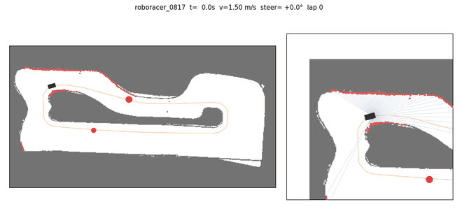
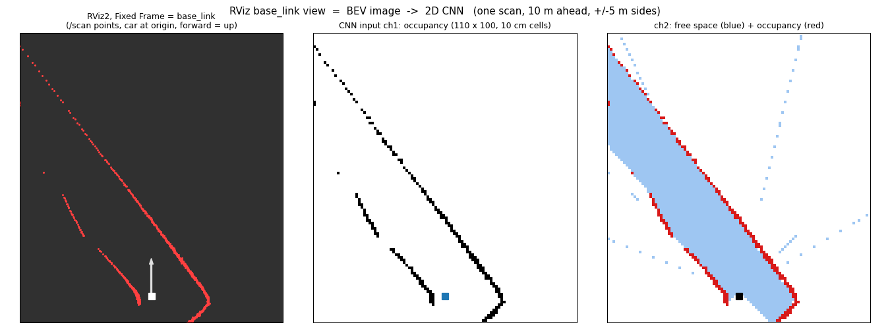

# mapless40 실험 기록 (2026-09-28 ~ 09-30)

LiDAR·IMU·속도만 보고 맵·로컬라이제이션 없이 40 Hz 로 조향·속도를 내는 SAC 정책(asymmetric actor-critic) 학습 결과.
학습은 Colab 무료 T4, 평가·GIF 는 torch 없이 `np_actor`(numpy) 로 돌렸다.

## 1. 요약

| | 결과 (v3, 31.8만 스텝) | 비교 |
|--|--|--|
| **팀 맵 (Cartographer 0817), 장애물 없음** | 출발 4곳 모두 **3바퀴 무사고, 9.63~9.65 s** | 라인 이론 10.0 s, FTG 12.7 s |
| 팀 맵, 장애물 2개 | 4번 중 2번 3바퀴 (최고 9.18 s), 1번 1.9바퀴 | |
| **ifac, 장애물 없음** | 4번 중 1번 3바퀴, 2번 1~2바퀴 후 충돌, **최고 10.9 s** | 이론 11.0 s, pure pursuit 11.5 s, FTG 18.0 s |
| ifac, 장애물 2개 | 4번 중 2번 3바퀴 (10.88~11.3 s) | |
| Budapest (학습 안 한 트랙) | 2번 중 1번 60 s 무사고 | v2 에선 3/3 무사고 |

- 평균 속도 3.8~4.0 m/s (명령 범위 2~5 m/s).
- **주의:** 팀 맵은 Cartographer 맵이라 실제 트랙 벽이 없는 방 바닥까지 빈칸으로 찍혀 있다. 정책이 섬 둘레 코스보다 넓게 도는 구간이 있어
  "실제 트랙 폭 안에서 9.6 s" 로 읽으면 안 된다. 실제 트랙 경계를 맵에 막아 넣고 다시 평가해야 한다.
- 시뮬 차량의 서보·구동 지연, 타력 감속, 코너 한계는 **실측 전 추정값(불리한 쪽)** 이다 (§3).

| v3 31.8만 스텝 · ifac | v3 31.8만 스텝 · 팀 맵 |
|--|--|
|  |  |

| v3 20만 스텝 · 팀 맵 + 장애물 2개 | v2 43만 스텝 · 팀 맵 (실패: 넓은 트랙에 치우침) |
|--|--|
|  |  |

GIF: 왼쪽 = 트랙 전체 + 지나온 궤적(속도 색) + 장애물(빨강), 오른쪽 = 차 주변 10 m, 파란 선 = LiDAR 빔, 빨간 점 = 맞은 점.
만들기: `python -m mapless40.drive_gif --model best_model.zip --map ifac --laps 2 [--obstacles 2] --out x.gif`

## 2. 현재 구조 (v3 기본값)

```
LiDAR 최근 4스캔 (4 × 1125빔, 10 m 에서 자르고 /10)
  └ 1D CNN (프레임마다 같은 가중치): Conv1d 16·k7·s3 → 32·k5·s3 → 64·k5·s2   (1125 → 375 → 125 → 63)
    → AvgPool k7 (9칸) → FC 48  ×4프레임 = 192 ─┐
상태 17 (v̄×4, ω̄×4, ω_latest, 직전 명령 2개, Δt×4) → FC 32 ─┴→ MLP 256·256 → tanh → (조향, 속도 2~5 m/s)

critic 만 추가로: 레이싱라인 오차·곡률·v_ref 10점, 앞 장애물 위치 (privileged 27)
```

- 제어 주기 = LiDAR 40 Hz. 스캔 n-4…n-1 과 그 구간 IMU(100 Hz)·VESC 속도(50 Hz) 평균 → 명령 n.
- γ = 0.99^(1/4) ≈ 0.9975 (10 Hz 0.99 와 같은 시간 지평).
- 다른 인코더: `--encoder bev`(4프레임 IMU 정렬 BEV 150×150), `both`(1D ‖ BEV), `bev1`(최신 1장, RViz base_link 그림과 같은 2×110×100).
  2D CNN 은 코랩 T4 에서 느려 노트북 확보 후 비교 예정.



## 3. 시뮬레이터

| 부분 | 모델 | 값 출처 |
|--|--|--|
| 차량 | 단일 트랙, 선형 타이어, RK4 5 ms, 저속 운동학 전환. 횡가속 6 m/s² 넘으면 요레이트 포화 (마찰 한계 근사) | 휠베이스 실측, 질량·관성·코너링 강성은 f1tenth_gym 기본값, μ ±10% |
| 서보 | 지연 15 ms + 1차 50 ms + 4 rad/s, ±21.4° | 최대각 실측, 나머지 **추정** |
| 구동 | 지연 30 ms, P 제어, 가속 5 m/s², jerk 40, **능동 브레이크 없음**, 타력 감속 0.6 + 0.15·v | 브레이크 없음은 control_node 기준, 수치 **추정** |
| LiDAR | 1125빔 레이캐스팅 + 원통 장애물, 노이즈 2 cm, 누락 0.5%, 장착 오프셋 | LPX-T1 사양, 팀 TF |
| IMU·속도 | 100 Hz 자이로(노이즈+바이어스), 50 Hz 속도 | 실차 주기 |
| 타이밍 | 계산 지연 10 ms, 틱 흔들림, 스캔 누락 | 추정 |
| 장애물 | 에피소드 70% 에 원통 1~3개 (r 0.12~0.30 m, 옆 통과 폭 ≥ 0.8 m) | |

**실측이 필요한 값**: 서보 step 응답, 타력 감속, 원 선회 한계 횡가속, 질량.

## 4. 실험 기록

### v1 — 1D + BEV 합친 인코더 (`both`), 09-28
- 업데이트 시작 후 **5 steps/s** → 100만 스텝에 50시간. BEV 빈공간 채널이 샘플당 4만 점을 scatter 하던 것을 극좌표 조회표(gather)로 바꿈.
- 그래도 코랩에서 느려 1D 로 전환.

### v2 — 1D CNN (`conv1d_lite_obs`), 09-28 ~ 09-29
설정: 학습 맵 ifac + Spielberg + Silverstone + Monza (균등), 평가 ifac + Budapest, range 15 m, target_entropy −2.

- 예전 1D CNN(32·64·64, stride 2)은 업데이트 1회 ≈ 130 GFLOP 로 **15 steps/s** → 채널·stride 조정으로 연산 1/6, **35 steps/s**.

| 스텝 | ifac | 팀 맵 0817 | 넓은 트랙 |
|--|--|--|--|
| 10만 | 3번 중 2번 1바퀴(11.3 / 11.5 s) 후 충돌 | – | Budapest 3/3 무사고 96 s |
| 13.9만 | 0/3 | – | Budapest 87 s |
| 18만 | 0/4 (오른쪽 헤어핀 출구에서 위쪽 트인 통로로 빠짐) | 4/4 3바퀴 9.8 s (맵 빈 공간을 넓게 씀) | |
| 43만 | 0/4 | **0/4** | Spielberg·Budapest 무사고 4.5 m/s |

→ 학습 맵 4개 중 3개가 넓은 F1 트랙이라 **넓은 트랙용 운전에 맞춰지며 좁은 트랙을 잊음**. 탐색도 ent_coef 0.004 로 꺼짐.

### v3 — `v3_conv1d`, 09-30
변경: 맵 비율 `ifac:3, roboracer_0817:3, Spielberg:1, Silverstone:1, Monza:1`, 평가에 팀 맵 추가,
target_entropy −1, 벽 여유 보상(차체 옆 0.25 m 미만이면 벌점), range 15 → 10 m.

| 스텝 | ent_coef | 학습 ep_len / 보상 | 평가 요약 |
|--|--|--|--|
| 5만 | 0.015 | 263 / −15 | 충돌 78%, ifac 0.1~0.2 바퀴 |
| 20만 | 0.009 | 1480 / +100 | 팀 맵 60 s 무사고 3/3, ifac 1/3, 최고 9.75 s |
| 31.8만 | – | – | §1 표 |

20만 스텝 실패 지점 (출발 위치와 무관하게 같은 곳):
- ifac 한 바퀴의 88~91% 지점(아래 직선) → 31.8만에서 해결, 대신 10% 지점에서 새로 충돌.
- 팀 맵 왼쪽 헤어핀에 4.5 m/s 로 진입해 최대 조향으로도 못 돎 (브레이크 없이 타력 감속만 가능 → 미리 감속 판단 부족).

## 5. 학습 인프라에서 겪은 문제와 수정

| 증상 | 원인 | 수정 |
|--|--|--|
| 실차 노드가 속도를 못 받음 | control_node `/vehicle/speed_mps` 는 Float64, 노드는 Float32 구독 | Float64 |
| IMU 샘플이 한 시각에 뭉침 | ebimu 시리얼 배치 수신 | IMU 는 header.stamp(PLL) 사용 |
| 라이다 정면 방향 불확실 | 08-15 실측 "정면 = 스캔 −177°", TF 기본 0 | TF yaw 사용 + 시작 시 차체 가림 구간이 뒤(±180°)인지 검사, 틀리면 명령 안 냄 |
| 코랩 끊기면 결과 없음 | 끝날 때만 저장 | 10분마다 `last_model`, 10만 스텝 체크포인트 |
| 이어 학습 직후 정책 붕괴 (ep_len 837 → 114) | SB3 가 빈 버퍼를 **무작위 행동**으로 채움 | 이어 학습 땐 불러온 정책으로 1만 스텝 수집 |
| 저장 중 `Pickling an AuthenticationString` | 모델 인스턴스에 함수를 붙임 | 클래스 교체 방식 |
| `BadZipFile` 로 재시작 실패 | 실패한 저장이 zip 을 반쯤 덮어씀 | 임시 파일 저장 → 검증 → 교체, 이어 학습 시 깨진 zip 건너뜀 |
| SB3 fps 가 실제 속도를 가림 | 누적 평균 | `[speed]` 줄: 최근 1분 steps/s, env vs 업데이트 시간 비율, 남은 시간 |

## 6. 도구

| 명령 | 용도 |
|--|--|
| `python -m mapless40.evaluate --model X.zip --maps ifac,roboracer_0817 --spawns 4 --laps 3 [--obstacles 2]` | 평가 (torch 없으면 numpy actor) |
| `python -m mapless40.drive_gif --model X.zip --map ifac --laps 2` | 주행 GIF |
| `python -m mapless40.ros_node --ros-args -p model:=X.zip -p meta:=none` | 실차/시뮬 ROS2 노드 (torch 없이 zip, 1.1 ms/틱) |
| `python -m mapless40.gym_adapter` | f1tenth_gym_ros ↔ 노드 토픽 연결 (README 12.1b) |

옛 모델(zip)은 zip 에 기록된 학습 때 LiDAR 설정(range_max 등)을 evaluate·drive_gif·ros_node 가 자동으로 쓴다.

## 7. 다음 단계

1. v3 계속 학습 → 40만~50만 스텝에서 ifac 완주율 확인.
2. 팀 맵에 **실제 트랙 경계**를 그려 넣고 재평가 (지금은 방 바닥까지 빈칸).
3. 실측: 서보 응답, 타력 감속, 코너 한계 → config 반영 후 재학습.
4. WSL + ROS2 Humble + f1tenth_gym_ros 로 파이프라인 확인 → 실차 `max_speed:=2.0` 부터.
5. 노트북 확보 후 1D vs `bev1` vs 여러 프레임 BEV 비교, 동적 장애물(상대 차) 시뮬 추가.
6. 후보: 트랙 자동 생성(맵 편향 제거), 교사→학생 증류, 실차 rosbag 재생 검사, 헤어핀 과속 대응(과속 벌점·진입 속도 다양화).
